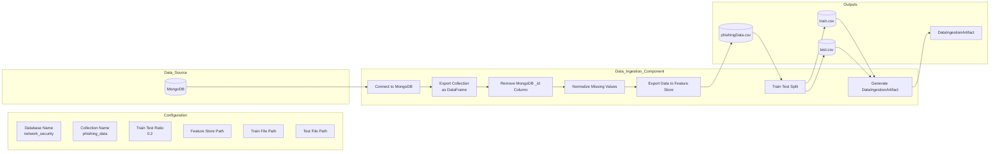
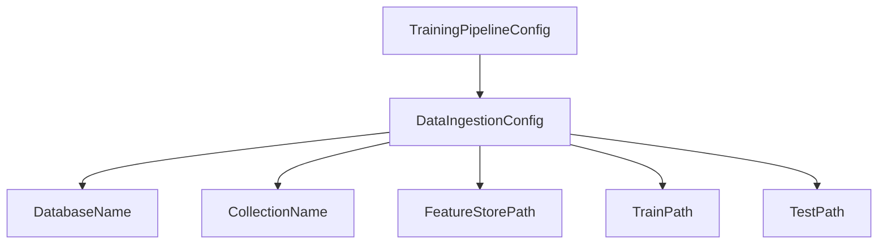
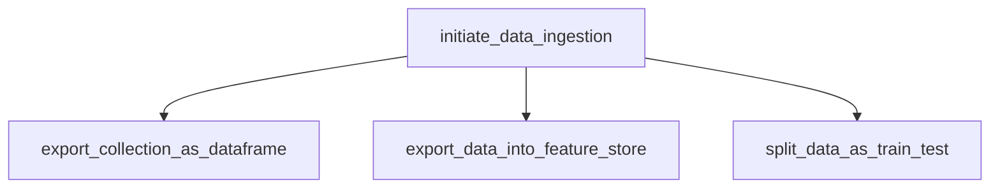
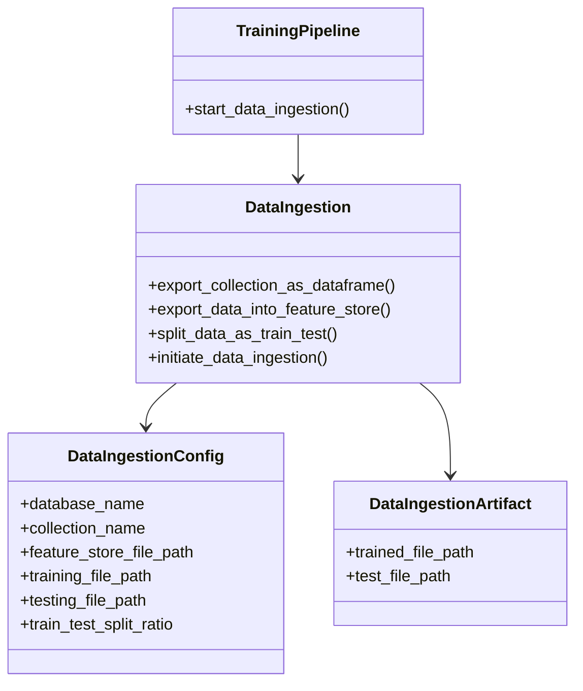
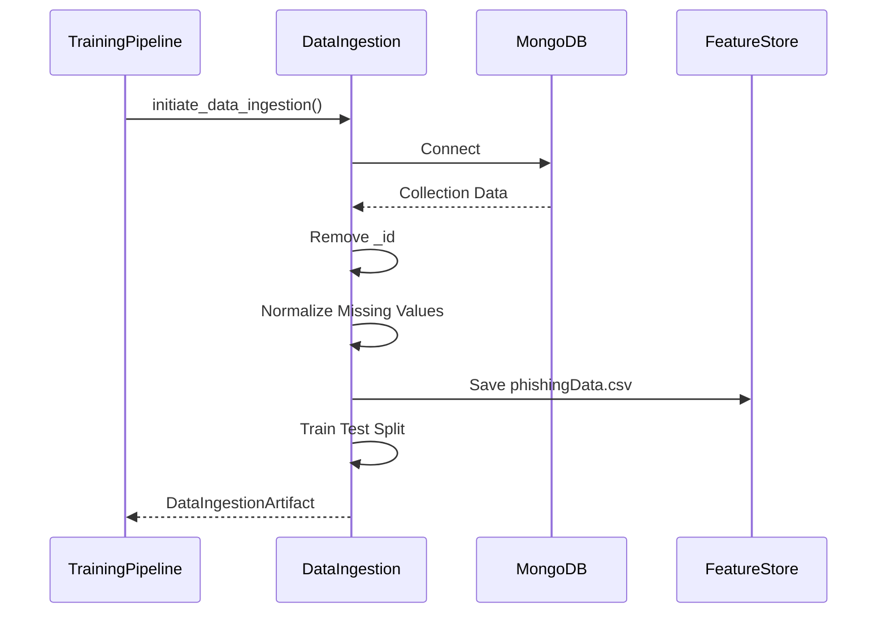
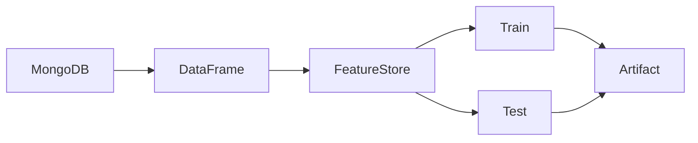
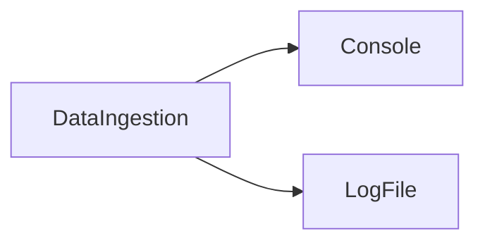
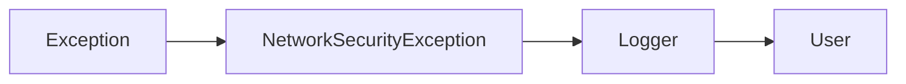
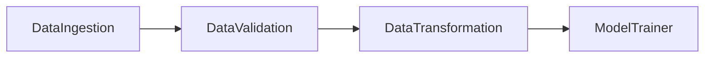

# Data Ingestion

## Executive Summary

The Data Ingestion component serves as the entry point of the Network Security MLOps pipeline. Its primary responsibility is to extract phishing website data from MongoDB, perform basic data standardization, persist the dataset into a feature store, create train and test datasets, and generate artifacts required by downstream pipeline stages.

This component establishes the foundation for the entire machine learning workflow by ensuring that raw source data is converted into a structured and reproducible format.

---

# Business Objective

The phishing detection model relies on a high-quality dataset for training and evaluation. The purpose of the Data Ingestion component is to:

* Retrieve data from MongoDB.
* Convert raw documents into a structured tabular format.
* Standardize missing value representations.
* Preserve a raw snapshot of the dataset.
* Create reproducible train and test datasets.
* Generate metadata artifacts for downstream stages.

---

# Component Location

```text
src/network_security_mlops/components/data_ingestion.py
```

---

# High-Level Architecture



---

# Configuration Hierarchy

The pipeline follows a configuration-driven architecture.



---

# Configuration Parameters

## Training Pipeline Constants

| Parameter          | Value            |
| ------------------ | ---------------- |
| Pipeline Name      | NetworkSecurity  |
| Artifact Directory | Artifacts        |
| File Name          | phishingData.csv |

## Data Ingestion Constants

| Parameter               | Value            |
| ----------------------- | ---------------- |
| Database Name           | network_security |
| Collection Name         | phishing_data    |
| Train-Test Split Ratio  | 0.2              |
| Feature Store Directory | feature_store    |
| Ingested Directory      | ingested         |

---

# Artifact Directory Structure

Each pipeline execution generates timestamp-based artifacts.

```text
Artifacts/
└── YYYY_MM_DD_HH_MM_SS/
    └── data_ingestion/
        ├── feature_store/
        │   └── phishingData.csv
        │
        └── ingested/
            ├── train.csv
            └── test.csv
```

---

# End-to-End Workflow

## Step 1: Load Configuration

The Data Ingestion component receives all runtime parameters from `DataIngestionConfig`.

This eliminates hardcoded paths and enables environment-independent execution.

---

## Step 2: Connect to MongoDB

The MongoDB connection string is loaded from environment variables.

```python
MONGO_DB_URL = os.getenv("MONGO_DB_URL")
```

The component establishes a connection using:

```python
pymongo.MongoClient(MONGO_DB_URL)
```

---

## Step 3: Export Collection as DataFrame

The configured MongoDB collection is queried.

```python
collection.find()
```

Documents are converted into a Pandas DataFrame.

```python
df = pd.DataFrame(list(collection.find()))
```

At this stage, each MongoDB document becomes a row in the DataFrame.

---

## Step 4: Remove MongoDB Metadata

MongoDB automatically injects an `_id` field into every document.

Since this field is not useful for machine learning, it is removed.

```python
df.drop(columns=["_id"])
```

### Before

```text
_id
URL_Length
Page_Rank
...
```

### After

```text
URL_Length
Page_Rank
...
```

---

## Step 5: Normalize Missing Values

The source dataset contains multiple textual representations of missing values.

Examples:

```text
na
NA
null
Null
None
```

These values are standardized into:

```python
np.nan
```

Implementation:

```python
df.replace(
    ["na", "NA", "null", "Null", "None"],
    np.nan,
    inplace=True
)
```

### Benefits

* Consistent preprocessing
* Improved data quality
* Better compatibility with Scikit-Learn transformers

---

## Step 6: Export Data to Feature Store

The cleaned dataset is persisted into the feature store.

Output:

```text
feature_store/phishingData.csv
```

Implementation:

```python
dataframe.to_csv(
    feature_store_file_path,
    index=False,
    header=True
)
```

### Why Feature Store?

The feature store serves as a reproducible snapshot of the source dataset.

Benefits:

* Auditability
* Debugging
* Reproducibility
* Data lineage tracking

---

## Step 7: Train-Test Split

The dataset is split into train and test datasets.

Implementation:

```python
train_test_split(
    dataframe,
    test_size=0.2,
    random_state=42
)
```

### Split Ratio

| Dataset | Percentage |
| ------- | ---------- |
| Train   | 80%        |
| Test    | 20%        |

Using a fixed random state ensures reproducible dataset generation.

---

## Step 8: Generate Artifact

The final output of this stage is a `DataIngestionArtifact`.

```python
@dataclass
class DataIngestionArtifact:
    trained_file_path: str
    test_file_path: str
```

Artifact generation enables loose coupling between pipeline stages.

---

# Method Responsibility Matrix

| Method                         | Responsibility                   |
| ------------------------------ | -------------------------------- |
| export_collection_as_dataframe | Extract dataset from MongoDB     |
| export_data_into_feature_store | Save dataset to feature store    |
| split_data_as_train_test       | Generate train and test datasets |
| initiate_data_ingestion        | Orchestrate ingestion workflow   |

---

# Method Call Graph



---

# Class Diagram



---

# Sequence Diagram



---

# Artifact Lifecycle



---

# Logging and Observability

The project uses centralized logging.

## Log Storage

```text
logs/
└── MM_DD_YYYY_HH_MM_SS.log
```

## Logging Architecture



## Sample Log Events

```text
Starting MongoDB data export

Fetched 11055 records from MongoDB

MongoDB export completed

Train-test split completed

Data ingestion pipeline completed
```

Benefits:

* Traceability
* Monitoring
* Debugging
* Auditability

---

# Exception Handling

All runtime exceptions are wrapped inside a custom exception.

```python
NetworkSecurityException
```

## Exception Flow



The custom exception captures:

* Source file name
* Line number
* Original error message

Example:

```text
Error occurred in python script name
[data_ingestion.py]
line number [87]
error message [Mongo Timeout]
```

---

# Output Artifacts

| Artifact              | Description                    |
| --------------------- | ------------------------------ |
| phishingData.csv      | Raw feature store dataset      |
| train.csv             | Training dataset               |
| test.csv              | Testing dataset                |
| DataIngestionArtifact | Metadata for downstream stages |

---

# Integration with Training Pipeline



The Data Ingestion component acts as the entry point for all downstream machine learning operations.

---

# Production Readiness Assessment

## Current Strengths

✅ Configuration-driven architecture

✅ Artifact-based pipeline design

✅ Centralized logging

✅ Custom exception handling

✅ Reproducible train-test split

✅ Modular component design

## Current Limitations

⚠ Full collection scan from MongoDB

⚠ No schema validation during ingestion

⚠ No duplicate record detection

⚠ No data versioning

⚠ No retry mechanism

⚠ No incremental ingestion strategy

---

# Future Enhancements

## Incremental Data Ingestion

Process only newly inserted records instead of scanning the entire collection.

## Data Versioning

Integrate DVC to track dataset versions.

## Schema Validation

Validate dataset structure before exporting to feature store.

## Retry Strategy

Implement retry mechanisms for transient MongoDB failures.

## Connection Pooling

Improve database performance for large-scale workloads.

## Data Quality Monitoring

Track:

* Null percentages
* Duplicate records
* Schema drift
* Dataset volume

---

# Summary

The Data Ingestion component is responsible for acquiring phishing website data from MongoDB, performing basic data standardization, storing a reproducible snapshot within the feature store, generating train and test datasets, and producing artifacts required by downstream pipeline stages. The component follows a configuration-driven, artifact-based architecture that promotes modularity, reproducibility, maintainability, and scalability across the machine learning lifecycle.
