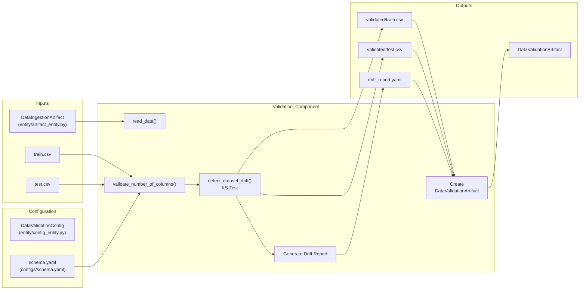
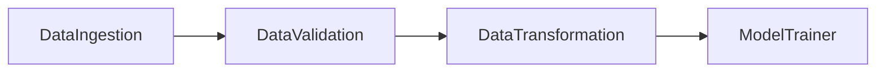
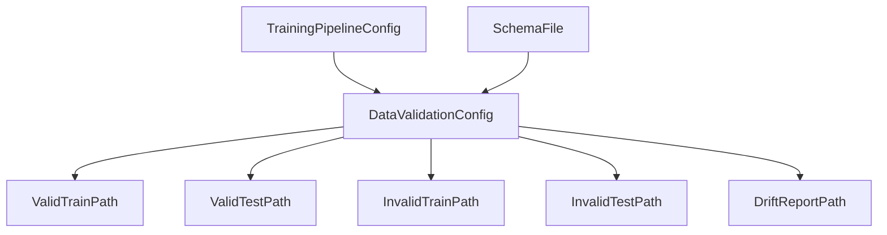
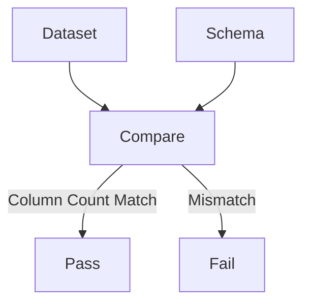
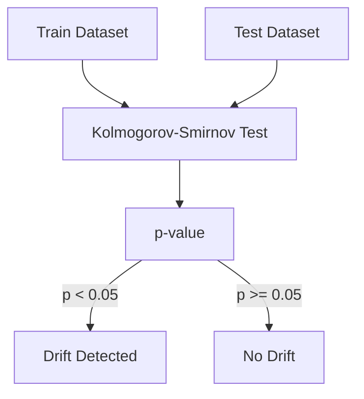
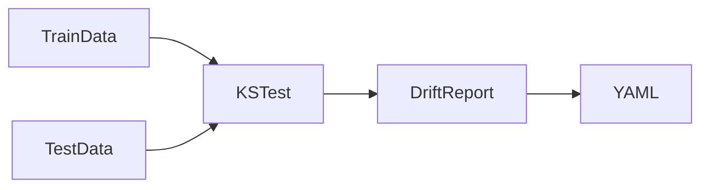
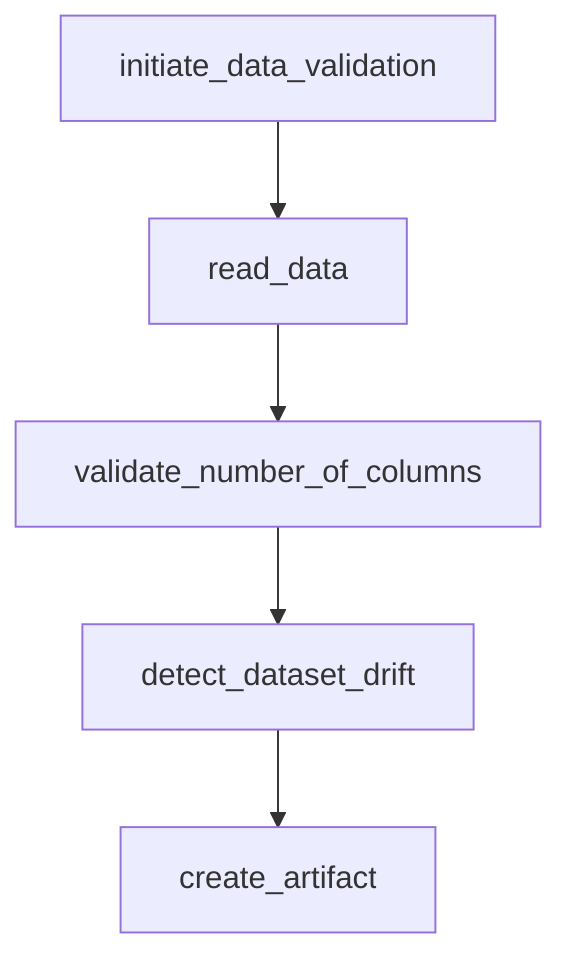
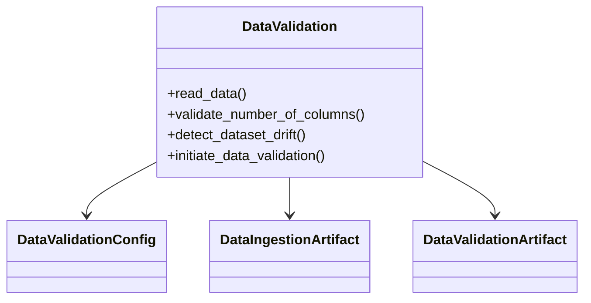
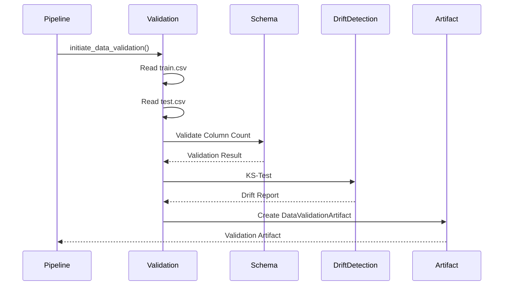

# Data Validation

## Executive Summary

The Data Validation component is responsible for ensuring that datasets produced by the Data Ingestion stage meet the minimum structural requirements expected by downstream machine learning components.

This stage performs two primary validation checks:

1. **Schema Validation**
   - Ensures the dataset contains the expected number of columns defined in `schema.yaml`.

2. **Data Drift Detection**
   - Compares training and testing datasets using the Kolmogorov-Smirnov (KS) statistical test.
   - Identifies significant distribution shifts between datasets.

After successful validation, validated datasets and drift reports are persisted as artifacts for downstream pipeline stages.

---

# Business Objective

Machine Learning models are highly sensitive to data quality issues.

The Data Validation component helps ensure:

- Dataset structure remains consistent.
- Features expected by the model are available.
- Significant distribution shifts are detected before training.
- Validation results are traceable and reproducible.
- Downstream stages receive trusted datasets.

Without validation, model performance can degrade due to:

- Missing columns
- Unexpected schema changes
- Dataset drift
- Data quality issues

---

# Component Location

```text
src/network_security_mlops/components/data_validation.py
```

---

# High-Level Architecture



---

# Position in Training Pipeline



The Data Validation stage acts as a quality gate between Data Ingestion and Data Transformation.

---

# Configuration Hierarchy



---

# Configuration Sources

## Data Validation Configuration

Location:

```text
src/network_security_mlops/entity/config_entity.py
```

Responsible for:

- Validation artifact directory
- Valid dataset paths
- Invalid dataset paths
- Drift report path

---

## Schema Configuration

Location:

```text
configs/schema.yaml
```

Loaded during initialization:

```python
self._schema_config = read_yaml_file(Path(SCHEMA_FILE_PATH))
```

Schema defines:

- Expected columns
- Numerical features
- Target column

---

# Input Artifacts

Received from Data Ingestion:

```text
Artifacts/
└── timestamp/
    └── data_ingestion/
        └── ingested/
            ├── train.csv
            └── test.csv
```

Input artifact:

```python
@dataclass
class DataIngestionArtifact:
    trained_file_path: str
    test_file_path: str
```

---

# End-to-End Workflow

## Step 1: Load Validation Configuration

The component receives:

- Validation directory paths
- Drift report location
- Input datasets

and loads:

```text
schema.yaml
```

for schema validation.

---

## Step 2: Read Datasets

Method:

```python
read_data(file_path)
```

Implementation:

```python
pd.read_csv(file_path)
```

Datasets loaded:

```text
train.csv
test.csv
```

---

## Step 3: Schema Validation

Method:

```python
validate_number_of_columns()
```

Current validation logic:

```python
required_columns = len(schema["columns"])
dataframe_columns = len(dataframe.columns)

return dataframe_columns == required_columns
```

Validation compares:

```text
Expected Columns
vs
Actual Columns
```

Example:

| Metric | Value |
|----------|----------|
| Expected Columns | 31 |
| Actual Columns | 31 |
| Result | PASS |

---

# Schema Validation Flow



---

# Current Schema Validation Scope

The current implementation validates:

✅ Total Number of Columns

The current implementation does NOT validate:

❌ Column Names

❌ Column Order

❌ Data Types

❌ Missing Required Features

❌ Extra Features

These limitations should be considered for production deployments.

---

# Step 4: Data Drift Detection

Method:

```python
detect_dataset_drift()
```

Purpose:

Determine whether training and testing datasets originate from similar statistical distributions.

---

# Drift Detection Technique

The component uses:

```python
scipy.stats.ks_2samp
```

for every feature.

Implementation:

```python
test_result = ks_2samp(d1, d2)
```

where:

```text
d1 = Train Feature Distribution

d2 = Test Feature Distribution
```

---

# KS-Test Decision Logic



---

# Understanding p-value

Decision threshold:

```python
threshold = 0.05
```

Logic:

| p-value | Interpretation |
|----------|----------|
| ≥ 0.05 | No Drift |
| < 0.05 | Drift Detected |

Example:

| Feature | p-value | Drift Status |
|----------|----------|----------|
| URL_Length | 0.74 | False |
| Page_Rank | 0.03 | True |
| SSLfinal_State | 0.65 | False |

---

# Drift Report Generation

For every feature:

```python
report[column] = {
    "p_value": float(test_result.pvalue),
    "drift_status": drift_found,
}
```

Report location:

```text
Artifacts/
└── timestamp/
    └── data_validation/
        └── drift_report/
            └── drift_report.yaml
```

Generated using:

```python
write_yaml_file()
```

---

# Example Drift Report

```yaml
URL_Length:
  p_value: 0.84
  drift_status: false

Page_Rank:
  p_value: 0.02
  drift_status: true

SSLfinal_State:
  p_value: 0.66
  drift_status: false
```

---

# Drift Report Lifecycle



---

# Step 5: Save Validated Datasets

After successful validation:

```text
validated/train.csv

validated/test.csv
```

are generated.

Location:

```text
Artifacts/
└── timestamp/
    └── data_validation/
        └── validated/
            ├── train.csv
            └── test.csv
```

---

# Step 6: Create Validation Artifact

Final output:

```python
DataValidationArtifact
```

Definition:

```python
@dataclass
class DataValidationArtifact:
    drift_validation_status: bool
    valid_train_file_path: str
    valid_test_file_path: str
    invalid_train_file_path: str
    invalid_test_file_path: str
    drift_report_file_path: str
```

---

# Understanding drift_validation_status

Current logic:

```python
status = True
```

If any feature drifts:

```python
status = False
```

Meaning:

| Value | Meaning |
|---------|---------|
| True | No Drift Found |
| False | Drift Detected |

---

# Artifact Directory Structure

```text
Artifacts/
└── timestamp/
    └── data_validation/
        ├── validated/
        │   ├── train.csv
        │   └── test.csv
        │
        ├── invalid/
        │   ├── train.csv
        │   └── test.csv
        │
        └── drift_report/
            └── drift_report.yaml
```

---

# Method Responsibility Matrix

| Method | Responsibility |
|----------|---------------|
| read_data | Load CSV dataset |
| validate_number_of_columns | Schema validation |
| detect_dataset_drift | Drift detection |
| initiate_data_validation | Validation orchestration |

---

# Method Call Graph



---

# Class Diagram



---

# Sequence Diagram



---

# Logging and Observability

Validation events are logged through:

```python
logger.info()
```

Examples:

```text
Starting data validation

Required columns: 31

Dataframe columns: 31

Drift report saved at:
Artifacts/.../drift_report.yaml

Data validation completed
```

Benefits:

- Easier debugging
- Validation traceability
- Audit support

---

# Exception Handling

All runtime exceptions are wrapped inside:

```python
NetworkSecurityException
```

Benefits:

- File name tracking
- Line number tracking
- Consistent error reporting

---

# Output Artifacts

| Artifact | Description |
|----------|-------------|
| validated/train.csv | Validated training dataset |
| validated/test.csv | Validated testing dataset |
| drift_report.yaml | Dataset drift report |
| DataValidationArtifact | Metadata for downstream stages |

---

# Production Readiness Assessment

## Current Strengths

✅ Configuration-driven architecture

✅ Artifact-based workflow

✅ Schema validation

✅ Statistical drift detection

✅ YAML-based reporting

✅ Centralized logging

✅ Custom exception handling

---

## Current Limitations

⚠ Only validates column count

⚠ Does not validate column names

⚠ Does not validate datatypes

⚠ Does not validate null constraints

⚠ Invalid dataset directory is never used

⚠ Drift threshold is hardcoded

⚠ No automated alerting mechanism

⚠ No historical drift tracking

---

# Future Enhancements

## Column-Level Schema Validation

Validate:

- Column names
- Datatypes
- Missing features

---

## Great Expectations Integration

Add enterprise-grade validation rules.

---

## Evidently AI Integration

Generate advanced drift dashboards.

---

## Historical Drift Monitoring

Track drift trends across multiple pipeline executions.

---

## Automated Notifications

Trigger alerts when drift exceeds threshold.

---

## Validation Dashboard

Visualize:

- Validation status
- Drift trends
- Dataset quality metrics

---

# Summary

The Data Validation component ensures structural consistency and statistical stability of datasets before they enter the transformation stage. It validates dataset schema, detects feature-level drift using the Kolmogorov-Smirnov test, generates YAML-based drift reports, stores validated datasets, and produces a DataValidationArtifact that drives downstream machine learning operations.