# Data Transformation

## Executive Summary

The Data Transformation component is responsible for converting validated datasets into a machine-learning-ready format. This stage applies preprocessing techniques, handles missing values, separates features and target variables, transforms datasets into NumPy arrays, and persists preprocessing artifacts for both training and inference workflows.

The primary objective of this component is to ensure that all downstream machine learning models receive clean, consistent, and numerical input data.

---

# Business Objective

Machine learning algorithms require structured numerical inputs and cannot reliably operate on incomplete datasets containing missing values.

The Data Transformation component helps:

* Handle missing values consistently.
* Convert validated datasets into model-ready format.
* Preserve preprocessing logic for inference.
* Prevent data leakage during training.
* Generate reusable transformation artifacts.

Without transformation:

* Missing values can cause model failures.
* Training and inference pipelines may become inconsistent.
* Reproducibility becomes difficult.

---

# Component Location

```text
src/network_security_mlops/components/data_transformation.py
```

---

# Position in Training Pipeline


Data Transformation acts as the bridge between validated datasets and model training.

---

# High-Level Architecture

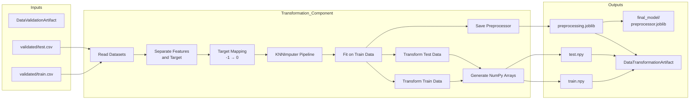

---

# Configuration Hierarchy

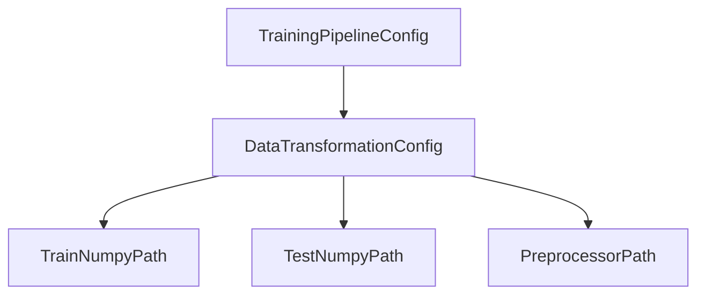

---

# Configuration Sources

## Data Transformation Configuration

Location:

```text
src/network_security_mlops/entity/config_entity.py
```

Responsible for:

* Train numpy file path
* Test numpy file path
* Preprocessor object path
* Transformation artifact directories

---

## Transformation Constants

Location:

```text
src/network_security_mlops/constant/training_pipeline/__init__.py
```

Important constants:

```python
TARGET_COLUMN = "Result"
```

```python
DATA_TRANSFORMATION_IMPUTER_PARAMS = {
    "missing_values": np.nan,
    "n_neighbors": 3,
    "weights": "uniform",
}
```

---

# Input Artifacts

Received from Data Validation:

```text
Artifacts/
└── timestamp/
    └── data_validation/
        └── validated/
            ├── train.csv
            └── test.csv
```

Input artifact:

```python
@dataclass
class DataValidationArtifact:
    drift_validation_status
    valid_train_file_path
    valid_test_file_path
```

---

# End-to-End Workflow

## Step 1: Read Validated Datasets

Method:

```python
read_data()
```

Implementation:

```python
pd.read_csv(file_path)
```

Datasets loaded:

```text
validated/train.csv
validated/test.csv
```

---

## Step 2: Separate Features and Target

The target column is:

```python
TARGET_COLUMN = "Result"
```

Input features:

```python
input_feature_train_df = train_df.drop(columns=[TARGET_COLUMN])
```

Target labels:

```python
target_feature_train_df = train_df[TARGET_COLUMN]
```

---

# Feature-Target Separation

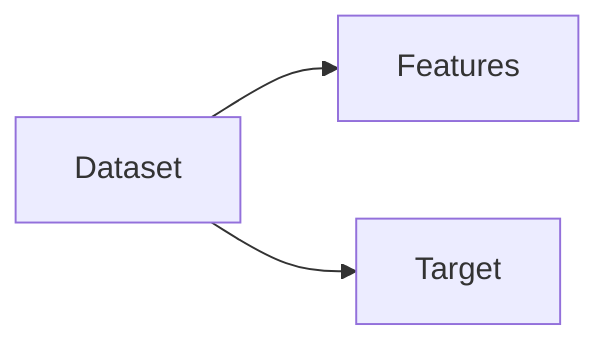

---

## Step 3: Target Label Transformation

The phishing dataset uses:

| Original Label | Meaning    |
| -------------- | ---------- |
| -1             | Legitimate |
| 1              | Phishing   |

The transformation stage converts:

```python
.replace(-1, 0)
```

Result:

| Original | Transformed |
| -------- | ----------- |
| -1       | 0           |
| 1        | 1           |

Final target labels become:

```text
0 → Legitimate

1 → Phishing
```

---

# Target Mapping Flow

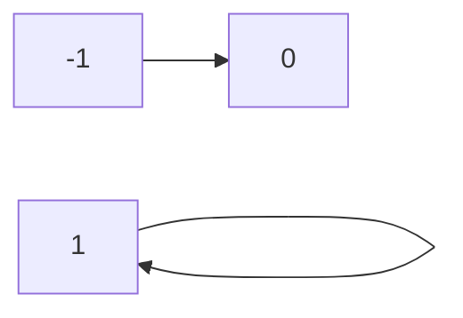

---

## Step 4: Create Preprocessing Pipeline

Method:

```python
get_data_transformer_object()
```

Pipeline:

```python
Pipeline([
    ("imputer", KNNImputer())
])
```

Current preprocessing consists of:

* Missing value imputation
* No scaling
* No encoding
* No feature selection

---

# KNN Imputer Configuration

```python
{
    "missing_values": np.nan,
    "n_neighbors": 3,
    "weights": "uniform"
}
```

Meaning:

| Parameter      | Value   |
| -------------- | ------- |
| missing_values | np.nan  |
| n_neighbors    | 3       |
| weights        | uniform |

---

# KNN Imputation Architecture


---

# How KNN Imputer Works

For a missing value:

1. Find the 3 nearest records.
2. Compute the average value.
3. Replace the missing value.

Example:

| Record | URL_Length |
| ------ | ---------- |
| A      | Missing    |
| B      | 54         |
| C      | 58         |
| D      | 52         |

Imputed value:

```text
(54 + 58 + 52) / 3

= 54.67
```

---

## Step 5: Fit Preprocessor on Training Data

Implementation:

```python
preprocessor.fit(input_feature_train_df)
```

This learns imputation statistics only from training data.

---

# Data Leakage Prevention

A critical ML principle is followed:

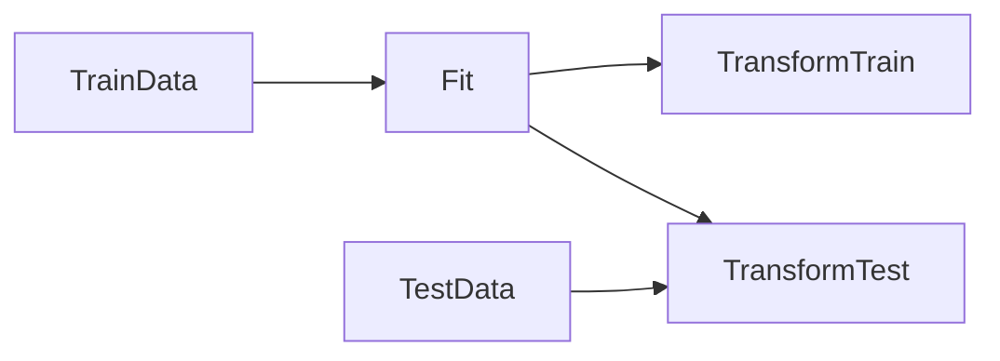

Training data is used for fitting.

Test data is never used during fit.

This prevents data leakage.

---

## Step 6: Transform Train Dataset

Implementation:

```python
preprocessor.transform(
    input_feature_train_df
)
```

Result:

```text
Missing values replaced
```

---

## Step 7: Transform Test Dataset

Implementation:

```python
preprocessor.transform(
    input_feature_test_df
)
```

The same preprocessing learned from train data is applied.

---

## Step 8: Create Model-Ready Arrays

Train array:

```python
np.c_[
    transformed_features,
    target_labels
]
```

Test array:

```python
np.c_[
    transformed_features,
    target_labels
]
```

Final structure:

```text
Feature1
Feature2
Feature3
...
FeatureN
Target
```

---

# Array Generation Flow

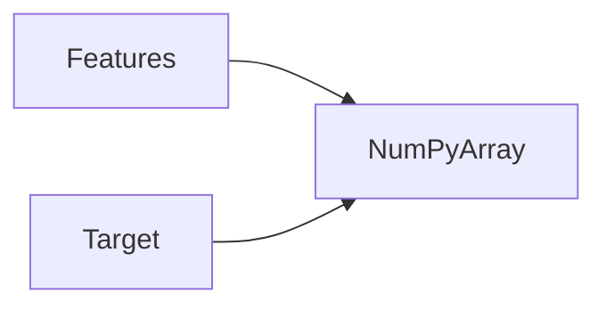

---

## Step 9: Save Transformed Datasets

Generated files:

```text
train.npy

test.npy
```

Location:

```text
Artifacts/
└── timestamp/
    └── data_transformation/
        └── transformed/
            ├── train.npy
            └── test.npy
```

---

## Step 10: Save Preprocessing Object

Method:

```python
save_object()
```

Saved artifacts:

```text
preprocessing.joblib
```

and

```text
final_model/preprocessor.joblib
```

---

# Why Save the Preprocessor?

Training and inference must use identical preprocessing logic.

Without this:

```text
Training Pipeline
≠
Prediction Pipeline
```

leading to inconsistent predictions.

---

# Inference Architecture

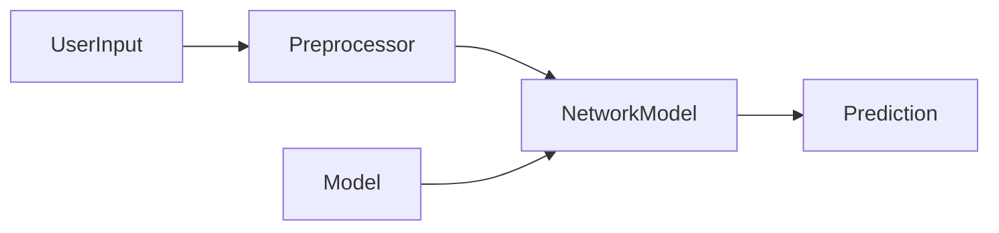

Implementation:

```python
class NetworkModel:
```

Location:

```text
utils/ml_utils/model/estimator.py
```

Prediction workflow:

```python
x_transform = self.preprocessor.transform(x)

y_hat = self.model.predict(x_transform)
```

---

# Artifact Lifecycle

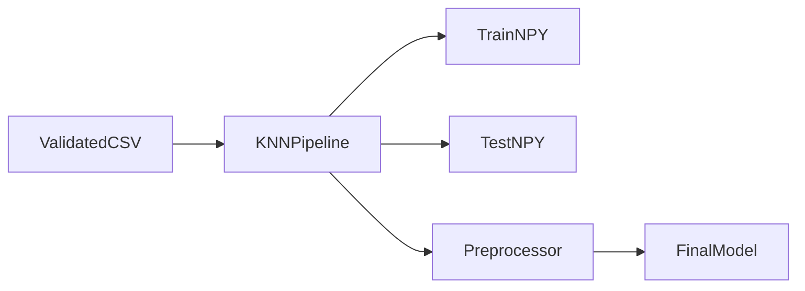

---

# Artifact Directory Structure

```text
Artifacts/
└── timestamp/
    └── data_transformation/
        ├── transformed/
        │   ├── train.npy
        │   └── test.npy
        │
        └── transformed_object/
            └── preprocessing.joblib
```

Production-ready artifact:

```text
final_model/
└── preprocessor.joblib
```

---

# Output Artifact

```python
@dataclass
class DataTransformationArtifact:
    transformed_object_file_path
    transformed_train_file_path
    transformed_test_file_path
```

---

# Method Responsibility Matrix

| Method                       | Responsibility                  |
| ---------------------------- | ------------------------------- |
| read_data                    | Read validated datasets         |
| get_data_transformer_object  | Create preprocessing pipeline   |
| initiate_data_transformation | Execute transformation workflow |

---

# Method Call Graph

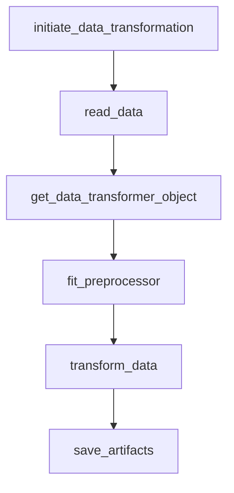

---

# Class Diagram

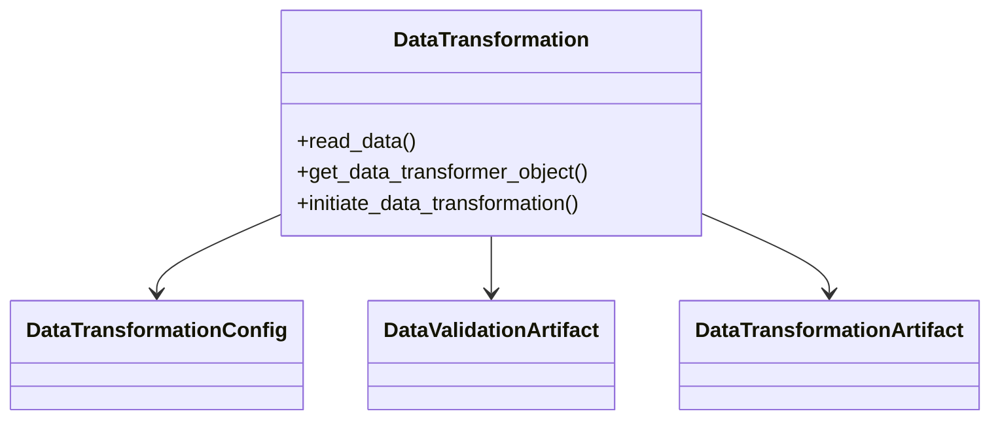

---

# Sequence Diagram

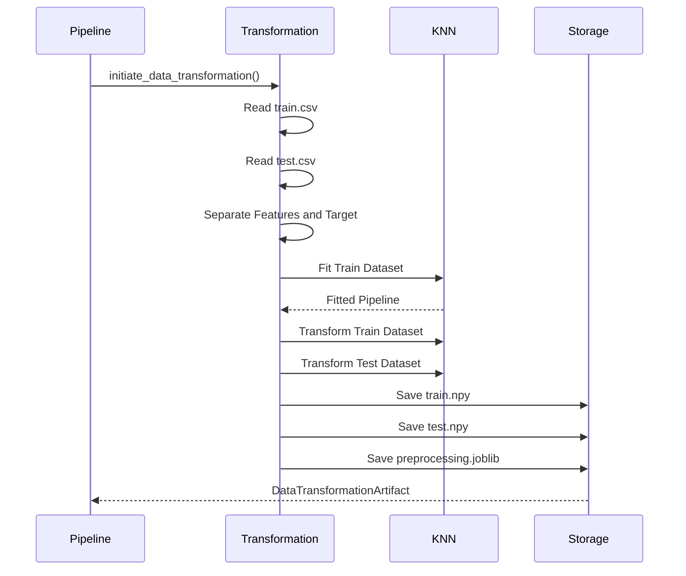

---

# Logging and Observability

Key logged events:

```text
Starting data transformation

Initializing KNNImputer

Saving transformed numpy arrays

Saving preprocessor object

Data transformation completed
```

Benefits:

* Traceability
* Debugging
* Artifact auditing

---

# Exception Handling

All exceptions are wrapped using:

```python
NetworkSecurityException
```

Benefits:

* File tracking
* Line number tracking
* Standardized error reporting

---

# Output Artifacts

| Artifact                        | Description                   |
| ------------------------------- | ----------------------------- |
| train.npy                       | Transformed training dataset  |
| test.npy                        | Transformed testing dataset   |
| preprocessing.joblib            | Saved preprocessing pipeline  |
| final_model/preprocessor.joblib | Production-ready preprocessor |
| DataTransformationArtifact      | Metadata for Model Trainer    |

---

# Production Readiness Assessment

## Current Strengths

✅ KNN-based missing value handling

✅ Train-test leakage prevention

✅ Reusable preprocessing pipeline

✅ Artifact-driven architecture

✅ Serialization support

✅ Inference-ready preprocessing object

---

## Current Limitations

⚠ No feature scaling

⚠ No feature selection

⚠ No outlier treatment

⚠ No dimensionality reduction

⚠ No categorical feature support

⚠ Single preprocessing strategy

---

# Future Enhancements

## Feature Scaling

Add:

* StandardScaler
* MinMaxScaler
* RobustScaler

---

## Feature Selection

Implement:

* Mutual Information
* Chi-Square
* Recursive Feature Elimination

---

## Pipeline Versioning

Track preprocessing versions across model releases.

---

## Feature Store Integration

Store transformed features centrally for reuse.

---

## Automated Data Quality Monitoring

Track:

* Missing values
* Imputation rates
* Feature distributions

---

# Summary

The Data Transformation component converts validated datasets into machine-learning-ready artifacts by handling missing values using KNN Imputation, transforming datasets into NumPy arrays, preserving preprocessing logic through serialized joblib objects, and generating reusable transformation artifacts for both model training and production inference workflows.
