# Model Trainer

## Executive Summary

The Model Trainer component is responsible for training multiple machine learning models, performing hyperparameter tuning, evaluating model performance, selecting the best-performing model, tracking experiments using MLflow, and generating deployment-ready model artifacts.

This stage transforms processed feature data into a production-ready phishing detection model.

---

# Business Objective

The objective of model training is to learn patterns that distinguish phishing websites from legitimate websites.

The Model Trainer component:

* Trains multiple classification algorithms.
* Performs hyperparameter optimization.
* Compares model performance.
* Selects the best model automatically.
* Calculates classification metrics.
* Logs experiments to MLflow.
* Generates deployment-ready artifacts.

Without this stage:

* No predictive model exists.
* No automated model selection exists.
* No experiment tracking exists.
* No deployment artifacts are produced.

---

# Component Location

```text
src/network_security_mlops/components/model_trainer.py
```

---

# Position in Training Pipeline

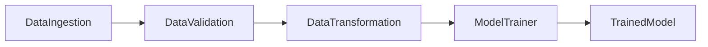

---

# High-Level Architecture

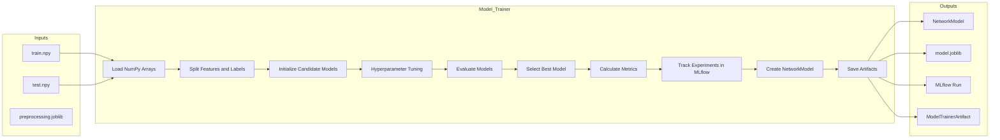

---

# Input Artifacts

Received from Data Transformation:

```text
Artifacts/
└── timestamp/
    └── data_transformation/
        ├── transformed/
        │   ├── train.npy
        │   └── test.npy
        │
        └── transformed_object/
            └── preprocessing.joblib
```

Input artifact:

```python
DataTransformationArtifact
```

Contains:

* transformed_train_file_path
* transformed_test_file_path
* transformed_object_file_path

---

# Configuration Sources

## Model Trainer Configuration

Location:

```text
src/network_security_mlops/entity/config_entity.py
```

Provides:

* Model output path
* Accuracy threshold
* Overfitting threshold

---

## Training Constants

Location:

```text
src/network_security_mlops/constant/training_pipeline/__init__.py
```

Important values:

```python
MODEL_TRAINER_EXPECTED_SCORE = 0.6
```

```python
MODEL_TRAINER_OVER_FIITING_UNDER_FITTING_THRESHOLD = 0.05
```

---

# End-to-End Workflow

## Step 1: Load Transformed Arrays

Method:

```python
load_numpy_array_data()
```

Loads:

```text
train.npy
test.npy
```

---

## Step 2: Separate Features and Labels

Implementation:

```python
X_train = train_arr[:, :-1]
y_train = train_arr[:, -1]

X_test = test_arr[:, :-1]
y_test = test_arr[:, -1]
```

Result:

```text
Features → X

Target → y
```

---

# Dataset Separation

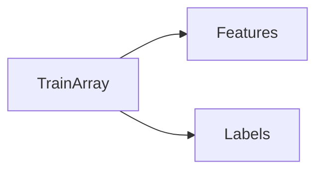

---

## Step 3: Initialize Candidate Models

The trainer evaluates five different machine learning algorithms.

### Random Forest

```python
RandomForestClassifier()
```

---

### Decision Tree

```python
DecisionTreeClassifier()
```

---

### Gradient Boosting

```python
GradientBoostingClassifier()
```

---

### Logistic Regression

```python
LogisticRegression()
```

---

### AdaBoost

```python
AdaBoostClassifier()
```

---

# Candidate Model Architecture

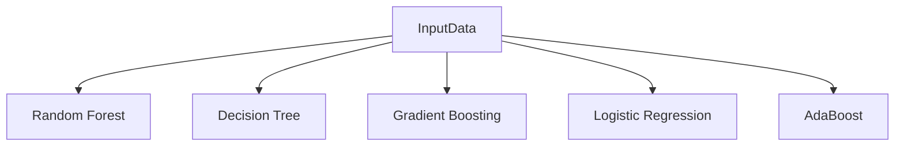

---

# Hyperparameter Search Space

## Decision Tree

```python
{
    "criterion": [
        "gini",
        "entropy",
        "log_loss"
    ]
}
```

---

## Random Forest

```python
{
    "n_estimators":
    [8,16,32,128,256]
}
```

---

## Gradient Boosting

```python
{
    "learning_rate":
    [0.1,0.01,0.05,0.001],

    "subsample":
    [0.6,0.7,0.75,0.85,0.9],

    "n_estimators":
    [8,16,32,64,128,256]
}
```

---

## AdaBoost

```python
{
    "learning_rate":
    [0.1,0.01,0.001],

    "n_estimators":
    [8,16,32,64,128,256]
}
```

---

# Hyperparameter Optimization Flow

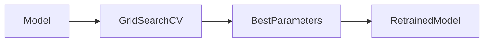

---

## Step 4: Model Evaluation

Method:

```python
evaluate_models()
```

Location:

```text
src/network_security_mlops/utils/io_utils.py
```

Responsibilities:

* Run GridSearchCV
* Train models
* Generate predictions
* Compute accuracy
* Build model report

---

# Model Selection Logic

The model report contains:

```python
{
    model_name: test_accuracy
}
```

Best model:

```python
best_model_score = max(
    sorted(model_report.values())
)
```

Highest test accuracy wins.

---

# Model Selection Flow

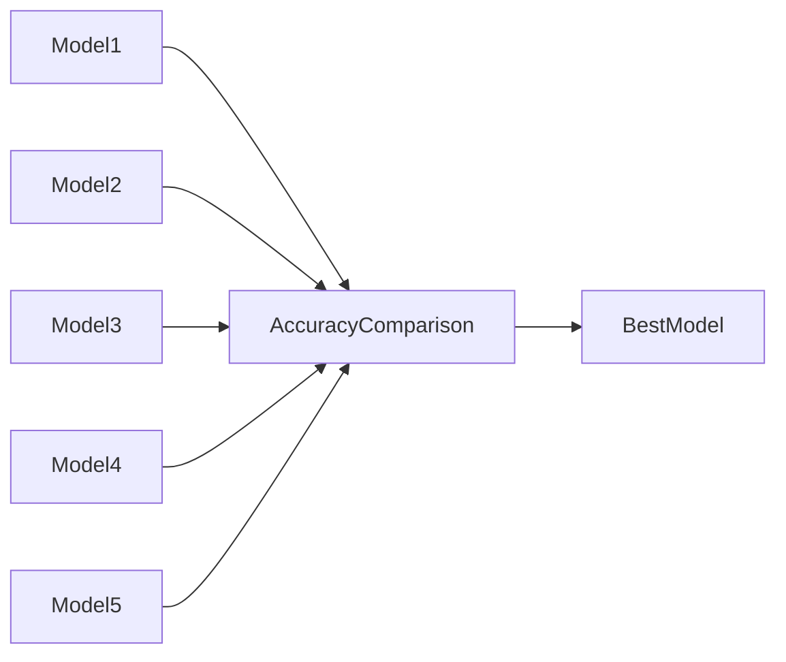

---

## Step 5: Classification Metrics

Location:

```text
src/network_security_mlops/utils/ml_utils/metric/classification_metric.py
```

Method:

```python
get_classification_score()
```

Metrics calculated:

* F1 Score
* Precision Score
* Recall Score

---

# Metric Definitions

## Precision

Measures:

```text
How many predicted phishing websites
were actually phishing.
```

Formula:

Precision = TP / (TP + FP)

---

## Recall

Measures:

```text
How many phishing websites
were successfully detected.
```

Formula:

Recall = TP / (TP + FN)

---

## F1 Score

Balances:

* Precision
* Recall

Formula:

F1 = 2 × Precision × Recall / (Precision + Recall)

---

# Classification Metrics Flow

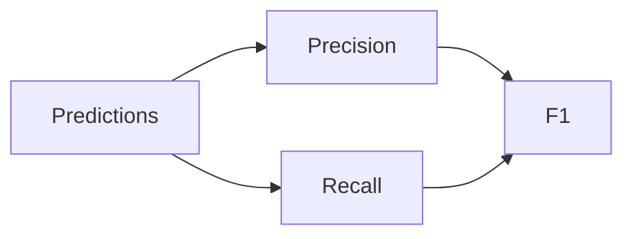

---

## Step 6: MLflow Tracking

MLflow tracking is optional.

Enabled through:

```bash
ENABLE_MLFLOW=true
```

---

# Experiment Tracking Architecture

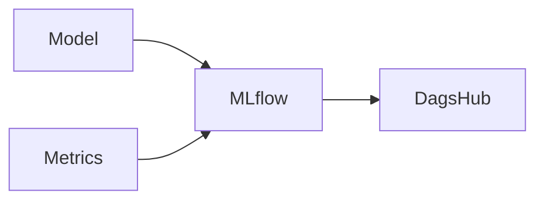

Tracked metrics:

```python
f1_score
precision_score
recall_score
```

Tracked artifact:

```python
best_model
```

---

## Step 7: Load Preprocessor

Method:

```python
load_object()
```

Loads:

```text
preprocessing.joblib
```

Generated during Data Transformation.

---

## Step 8: Create NetworkModel

Location:

```text
src/network_security_mlops/utils/ml_utils/model/estimator.py
```

Implementation:

```python
NetworkModel(
    preprocessor=preprocessor,
    model=best_model
)
```

Purpose:

Combine:

```text
Preprocessor
+
Model
=
Single Prediction Object
```

---

# Production Prediction Flow


---

# NetworkModel Architecture

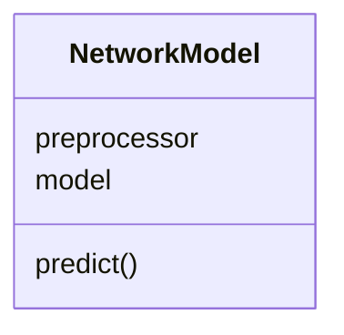

---

## Step 9: Save Artifacts

Saved model:

```text
Artifacts/
└── timestamp/
    └── model_trainer/
        └── trained_model/
            └── model.joblib
```

Additional deployment artifact:

```text
final_model/
└── model.joblib
```

---

# Artifact Lifecycle

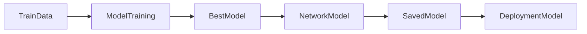

---

# Output Artifact

```python
@dataclass
class ModelTrainerArtifact:
    trained_model_file_path
    train_metric_artifact
    test_metric_artifact
```

---

# Method Responsibility Matrix

| Method                 | Responsibility            |
| ---------------------- | ------------------------- |
| initiate_model_trainer | Start training workflow   |
| train_model            | Train and evaluate models |
| track_mlflow           | Log metrics and model     |

---

# Method Call Graph

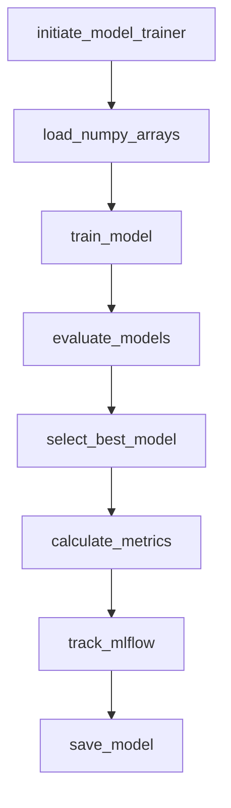

---

# Sequence Diagram

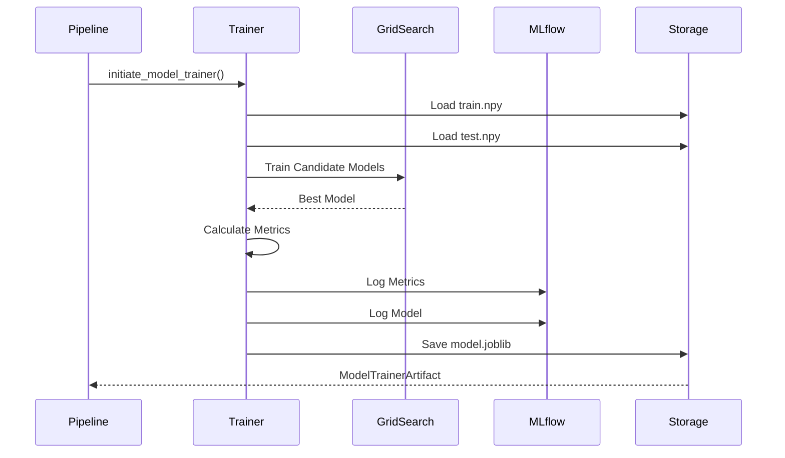

---

# Logging and Observability

Important log events:

```text
Starting model training

Initializing models

Evaluating models

Best model found

Loading preprocessing object

Saving trained model

Model training completed
```

Benefits:

* Training traceability
* Experiment reproducibility
* Easier debugging

---

# Exception Handling

All exceptions are wrapped using:

```python
NetworkSecurityException
```

Provides:

* File name
* Line number
* Root cause visibility

---

# Output Artifacts

| Artifact             | Description               |
| -------------------- | ------------------------- |
| train.npy            | Training data             |
| test.npy             | Testing data              |
| preprocessing.joblib | Preprocessing pipeline    |
| model.joblib         | Trained model             |
| NetworkModel         | Combined inference object |
| MLflow Run           | Experiment metadata       |
| ModelTrainerArtifact | Output metadata           |

---

# Production Readiness Assessment

## Current Strengths

✅ Multiple model evaluation

✅ Hyperparameter tuning

✅ Automated model selection

✅ MLflow integration

✅ DagsHub integration

✅ Deployment-ready model packaging

✅ F1, Precision, Recall tracking

✅ Reusable inference architecture

---

## Current Limitations

⚠ Selection based only on accuracy

⚠ No cross-validation reporting

⚠ No confusion matrix logging

⚠ No SHAP explainability

⚠ No model registry promotion workflow

⚠ No automated retraining trigger

---

# Future Enhancements

## Advanced Model Search

Add:

* XGBoost
* LightGBM
* CatBoost

---

## Explainable AI

Add:

* SHAP
* LIME
* Feature Importance Dashboards

---

## Model Registry

Promote models automatically through:

* Staging
* Production
* Archived

---

## Continuous Training

Implement:

* Drift-triggered retraining
* Scheduled retraining
* Automated model validation

---

# Summary

The Model Trainer component serves as the core intelligence layer of the Network Security MLOps pipeline. It trains multiple machine learning algorithms, performs hyperparameter tuning, evaluates performance, selects the best model, tracks experiments through MLflow and DagsHub, packages preprocessing and prediction logic into a reusable NetworkModel, and produces deployment-ready artifacts for phishing website detection.
