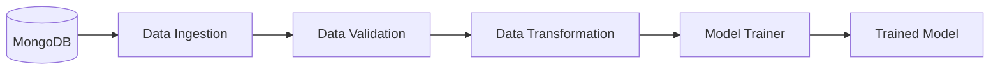
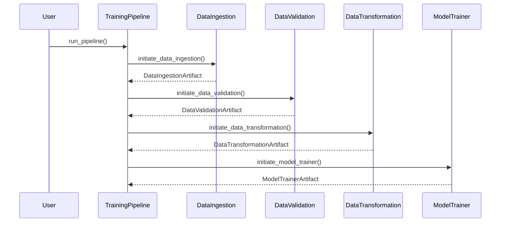
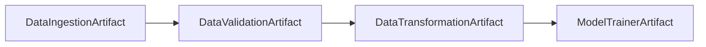
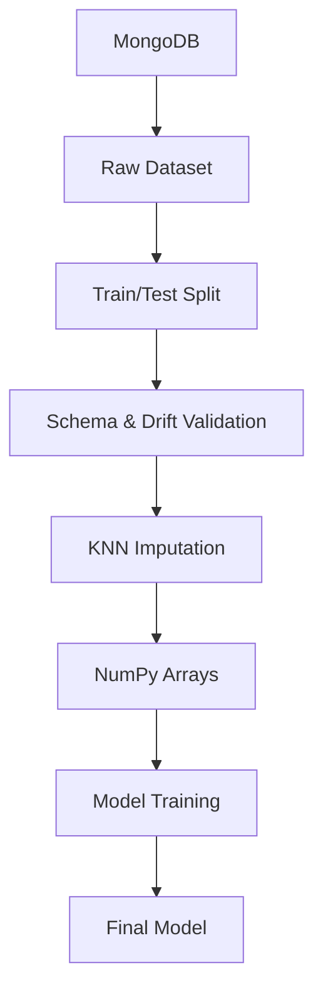
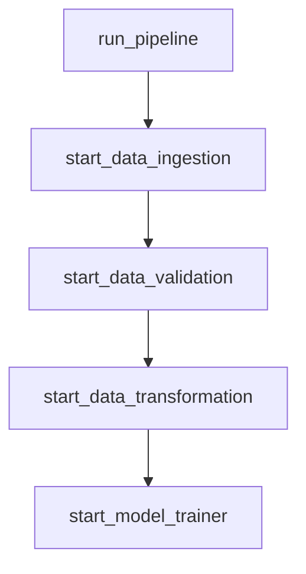

# Training Pipeline

## Executive Summary

The Training Pipeline serves as the orchestration layer of the Network Security MLOps project. It coordinates the execution of all pipeline stages, manages artifact flow between components, and ensures that the output of one stage becomes the input for the next stage.

The pipeline follows a sequential workflow:

1. Data Ingestion
2. Data Validation
3. Data Transformation
4. Model Training

At the end of execution, a production-ready phishing detection model is generated along with all intermediate artifacts required for reproducibility and debugging.

---

# Pipeline Location

```text
pipelines/training_pipeline.py
```

---

# Business Objective

The goal of the training pipeline is to automate the complete machine learning lifecycle from raw data acquisition to deployable model generation.

Without orchestration:

* Components would need manual execution.
* Artifact dependencies would be difficult to manage.
* Reproducibility would be reduced.
* Experiment tracking would become inconsistent.

The Training Pipeline solves these challenges by coordinating the entire workflow.

---

# High Level Architecture



---

# Pipeline Class

```python
class TrainingPipeline:
```

Responsibilities:

* Initialize pipeline configuration
* Execute pipeline stages
* Pass artifacts between components
* Manage execution order
* Return final model artifact

---

# Training Pipeline Configuration

Location:

```text
src/network_security_mlops/entity/config_entity.py
```

Class:

```python
TrainingPipelineConfig
```

Purpose:

Generate unique execution directories using timestamps.

Example:

```text
Artifacts/
└── 2026_06_11_10_30_25/
```

Each execution receives its own isolated artifact directory.

---

# Timestamp Based Versioning

During initialization:

```python
timestamp_str = timestamp.strftime(
    "%Y_%m_%d_%H_%M_%S"
)
```

Generated artifact path:

```python
Artifacts/<timestamp>
```

Example:

```text
Artifacts/
└── 2026_06_11_10_30_25/
```

Benefits:

* Reproducibility
* Experiment isolation
* Easier debugging
* Historical model comparison

---

# Pipeline Execution Flow



---

# Stage 1: Data Ingestion

Method:

```python
start_data_ingestion()
```

Component:

```text
src/network_security_mlops/components/data_ingestion.py
```

Responsibilities:

* Read data from MongoDB
* Create feature store
* Train-test split
* Generate ingestion artifacts

Output:

```python
DataIngestionArtifact
```

Contains:

```text
train.csv
test.csv
```

---

# Stage 2: Data Validation

Method:

```python
start_data_validation()
```

Input:

```python
DataIngestionArtifact
```

Component:

```text
src/network_security_mlops/components/data_validation.py
```

Responsibilities:

* Schema validation
* Column count verification
* Dataset drift detection
* Drift report generation

Output:

```python
DataValidationArtifact
```

Contains:

```text
validated/train.csv
validated/test.csv
drift_report.yaml
```

---

# Stage 3: Data Transformation

Method:

```python
start_data_transformation()
```

Input:

```python
DataValidationArtifact
```

Component:

```text
src/network_security_mlops/components/data_transformation.py
```

Responsibilities:

* Missing value handling
* KNN imputation
* Target transformation
* Feature preprocessing
* NumPy conversion

Output:

```python
DataTransformationArtifact
```

Contains:

```text
train.npy
test.npy
preprocessing.joblib
```

---

# Stage 4: Model Trainer

Method:

```python
start_model_trainer()
```

Input:

```python
DataTransformationArtifact
```

Component:

```text
src/network_security_mlops/components/model_trainer.py
```

Responsibilities:

* Train candidate models
* Hyperparameter tuning
* Model evaluation
* Model selection
* MLflow tracking
* Save deployment artifacts

Output:

```python
ModelTrainerArtifact
```

Contains:

```text
model.joblib
metrics
trained_model_path
```

---

# Artifact Flow Between Components



The pipeline follows an artifact-driven architecture.

Each stage receives the artifact generated by the previous stage.

---

# Artifact Hierarchy

Example execution:

```text
Artifacts/
└── 2026_06_11_10_30_25/
    │
    ├── data_ingestion/
    │   ├── feature_store/
    │   │   └── phishingData.csv
    │   │
    │   └── ingested/
    │       ├── train.csv
    │       └── test.csv
    │
    ├── data_validation/
    │   ├── validated/
    │   │   ├── train.csv
    │   │   └── test.csv
    │   │
    │   └── drift_report/
    │       └── drift_report.yaml
    │
    ├── data_transformation/
    │   ├── transformed/
    │   │   ├── train.npy
    │   │   └── test.npy
    │   │
    │   └── transformed_object/
    │       └── preprocessing.joblib
    │
    └── model_trainer/
        └── trained_model/
            └── model.joblib
```

---

# End-to-End Data Flow



---

# Error Handling Strategy

Every component wraps exceptions using:

```python
NetworkSecurityException
```

Location:

```text
src/network_security_mlops/utils/exception.py
```

Provides:

* Source file
* Line number
* Error message

Example:

```text
Error occurred in python script name
[data_validation.py]

line number [145]

error message [...]
```

Benefits:

* Faster debugging
* Better observability
* Easier root-cause analysis

---

# Logging Strategy

Location:

```text
src/network_security_mlops/utils/logger.py
```

Every pipeline stage logs:

```text
Starting Data Ingestion

Starting Data Validation

Starting Data Transformation

Starting Model Trainer

Training Pipeline Completed
```

Log files:

```text
logs/
└── timestamp.log
```

Benefits:

* Execution traceability
* Easier monitoring
* Pipeline auditing

---

# Method Responsibility Matrix

| Method                    | Responsibility               |
| ------------------------- | ---------------------------- |
| start_data_ingestion      | Execute ingestion stage      |
| start_data_validation     | Execute validation stage     |
| start_data_transformation | Execute transformation stage |
| start_model_trainer       | Execute model training stage |
| run_pipeline              | Execute complete workflow    |

---

# Method Call Graph



---

# Production Readiness Features

Current implementation provides:

✅ Modular architecture

✅ Artifact-based workflow

✅ Timestamp versioning

✅ MLflow integration

✅ DagsHub integration

✅ Centralized logging

✅ Custom exception handling

✅ Deployment-ready artifacts

---

# Future Improvements

## Pipeline Retry Mechanism

Add:

* Automatic retries
* Failure recovery

---

## Pipeline Scheduler

Integrate:

* Apache Airflow
* Prefect
* Dagster

---

## Data Versioning

Integrate:

* DVC
* LakeFS

---

## Model Registry

Add:

* Staging models
* Production models
* Rollback capability

---

## Automated Retraining

Trigger training when:

* Data drift exceeds threshold
* New data arrives
* Scheduled retraining occurs

---

# Summary

The Training Pipeline is the orchestration engine of the Network Security MLOps project. It coordinates Data Ingestion, Data Validation, Data Transformation, and Model Training while maintaining artifact lineage, reproducibility, observability, and deployment readiness. Through timestamp-based artifact management, centralized logging, and artifact-driven execution, the pipeline provides a scalable foundation for production-grade machine learning workflows.
