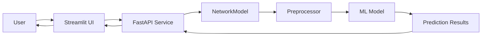
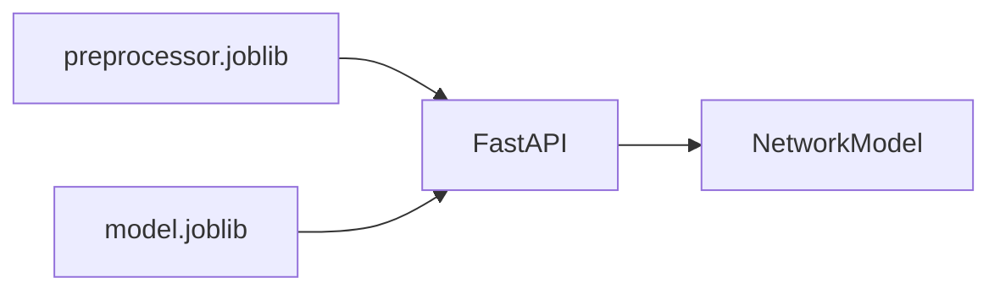
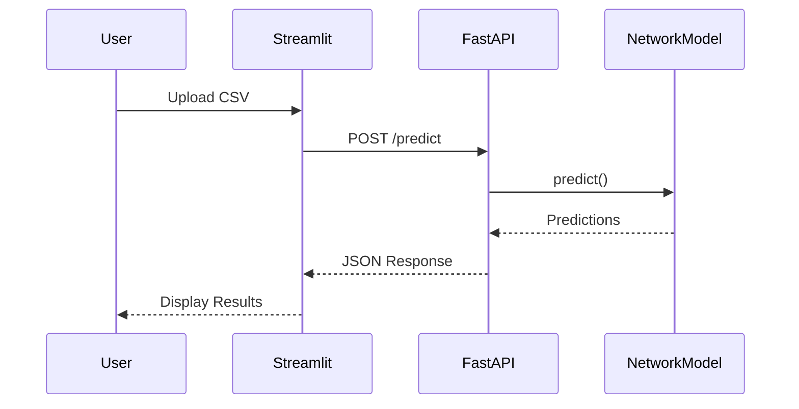
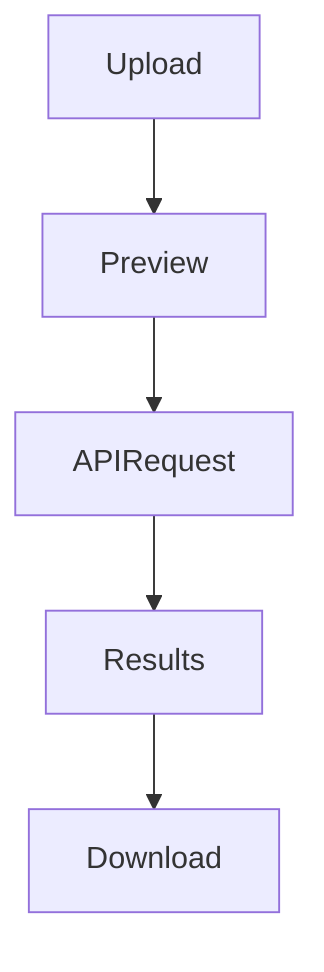
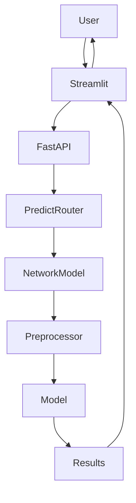

# Prediction Pipeline

## Executive Summary

The Prediction Pipeline is responsible for serving phishing detection predictions to end users. It provides a complete inference workflow consisting of a Streamlit frontend, FastAPI backend, and a production-ready machine learning model packaged through the `NetworkModel` abstraction.

Unlike the training workflow, which generates artifacts, the prediction workflow consumes deployment artifacts and performs real-time batch inference on uploaded datasets.

The prediction system enables users to upload a CSV file containing website features and receive phishing predictions without retraining the model.

---

# Architecture Overview



---

# Component Locations

## Streamlit Frontend

```text
streamlit_app/app.py
```

---

## FastAPI Application

```text
api/app.py
```

---

## Prediction Router

```text
api/routers/predict.py
```

---

## Training Router

```text
api/routers/train.py
```

---

## Health Router

```text
api/routers/health.py
```

---

## Model Wrapper

```text
src/network_security_mlops/utils/ml_utils/model/estimator.py
```

---

# Deployment Artifacts

Generated during training:

```text
final_model/
├── model.joblib
└── preprocessor.joblib
```

These artifacts are loaded once during application startup and reused for all prediction requests.

---

# Startup Lifecycle

The FastAPI application uses a lifespan handler.

Location:

```python
api/app.py
```

During startup:

```python
app.state.model = NetworkModel(
    preprocessor=load_object(
        Path("final_model") / "preprocessor.joblib"
    ),
    model=load_object(
        Path("final_model") / "model.joblib"
    )
)
```

---

# Startup Architecture



---

# Why Load Model During Startup

Without startup loading:

```text
Every request
    ↓
Load model from disk
    ↓
Predict
```

This causes unnecessary disk I/O.

Current implementation:

```text
Application Startup
    ↓
Load Model Once
    ↓
Store In Memory
    ↓
Reuse For Every Request
```

Benefits:

* Faster predictions
* Lower latency
* Reduced disk access
* Better scalability

---

# User Workflow

The user interacts through the Streamlit application.

---

## Step 1: Upload CSV

Supported format:

```text
.csv
```

Requirements:

```text
Must contain the same feature columns
used during training.
```

---

## Step 2: Preview Dataset

Streamlit displays:

* First 5 records
* Row count
* Column count

---

## Step 3: Submit Prediction Request

Request:

```http
POST /predict
```

Uploaded file is sent to FastAPI.

---

# Prediction Request Flow



---

# FastAPI Prediction Endpoint

Location:

```text
api/routers/predict.py
```

Route:

```python
@router.post("/predict")
```

Responsibilities:

* Receive uploaded CSV
* Convert CSV into DataFrame
* Invoke model prediction
* Store prediction results
* Return JSON response

---

# Data Processing Flow

```python
dataframe = pd.read_csv(file.file)
```

Uploaded CSV becomes:

```text
Pandas DataFrame
```

which is passed directly to:

```python
network_model.predict(dataframe)
```

---

# NetworkModel Architecture

Location:

```text
src/network_security_mlops/utils/ml_utils/model/estimator.py
```

Class:

```python
class NetworkModel
```

Purpose:

Combine preprocessing and prediction logic into a single reusable object.

---

# NetworkModel Workflow


Implementation:

```python
x_transform = self.preprocessor.transform(x)

y_hat = self.model.predict(x_transform)
```

---

# Prediction Lifecycle

## Input

```text
Raw CSV Features
```

---

## Preprocessing

```text
KNN Imputer
```

Same preprocessing object used during training.

This guarantees:

```text
Training Features
=
Inference Features
```

---

## Model Prediction

The trained model generates:

```text
1
or
0
```

prediction values.

---

## Output

Predictions are appended:

```python
dataframe["predicted_column"]
```

Result:

```text
Original Features
+
Prediction Column
```

---

# Prediction Storage

Every request receives a unique output file.

Implementation:

```python
output_path = (
    prediction_output /
    output_<uuid>.csv
)
```

Example:

```text
prediction_output/
├── output_34ab12cd.csv
├── output_9f5c21de.csv
└── output_7e3b89ff.csv
```

---

# Why UUID-Based Output Files

Previous approach:

```text
output.csv
```

Problem:

```text
Concurrent Requests
      ↓
Overwrite File
```

Current solution:

```text
UUID Filename
      ↓
Unique Output
```

Benefits:

* No collisions
* Concurrent request support
* Easier auditing

---

# Response Structure

The API returns:

```json
{
  "status": "success",
  "total_records": 100,
  "output_file": "...",
  "predictions": [],
  "data": []
}
```

---

# Response Flow


---

# Streamlit Result Dashboard

After receiving predictions:

The UI displays:

### Metrics

* Total Records
* Malicious URLs
* Benign URLs

---

### Prediction Table

Contains:

```text
Original Features
+
Predicted Column
```

---

### Download Button

Allows downloading:

```text
predictions.csv
```

---

# Streamlit Architecture



---

# Health Endpoint

Location:

```text
api/routers/health.py
```

Endpoint:

```http
GET /health
```

Response:

```json
{
  "status": "healthy"
}
```

Purpose:

* Container health checks
* Monitoring
* Load balancer probes

---

# Training Endpoint

Location:

```text
api/routers/train.py
```

Endpoint:

```http
GET /train
```

Triggers:

```python
TrainingPipeline().run_pipeline()
```

This allows model retraining directly from the Streamlit interface.

---

# Complete Inference Architecture



---

# Logging Strategy

Important events logged:

```text
Loading model and preprocessor

Model loaded successfully

Reading uploaded file

Running predictions

Prediction saved

Shutting down
```

Benefits:

* Traceability
* Debugging
* Monitoring

---

# Exception Handling

All exceptions are wrapped using:

```python
NetworkSecurityException
```

Provides:

* File name
* Line number
* Error details

---

# Current Strengths

✅ Streamlit UI

✅ FastAPI backend

✅ Startup model loading

✅ Reusable NetworkModel abstraction

✅ Batch prediction support

✅ Downloadable prediction files

✅ Health endpoint

✅ Training trigger endpoint

✅ UUID-based output management

---

# Current Limitations

⚠ No authentication

⚠ No request validation schema

⚠ No prediction confidence scores

⚠ No model version endpoint

⚠ No batch job history tracking

⚠ No rate limiting

⚠ No prediction monitoring

---

# Future Improvements

## Add Prediction Probabilities

Expose:

```python
predict_proba()
```

to return confidence scores.

---

## Add Pydantic Validation

Validate incoming requests before prediction.

---

## Add Model Version Endpoint

```http
GET /model/version
```

to identify deployed models.

---

## Add Prediction Monitoring

Track:

* Prediction volume
* Latency
* Drift indicators
* Error rates

---

## Add Batch Prediction Pipeline

Implement:

```text
pipelines/batch_prediction.py
```

for scheduled inference jobs.

---

# Summary

The Prediction Pipeline provides a production-oriented inference architecture built on Streamlit, FastAPI, and a reusable NetworkModel abstraction. The system loads trained artifacts during startup, performs efficient in-memory inference, supports batch CSV predictions, stores prediction outputs with UUID-based versioning, and exposes user-friendly interfaces for both prediction and model retraining.
