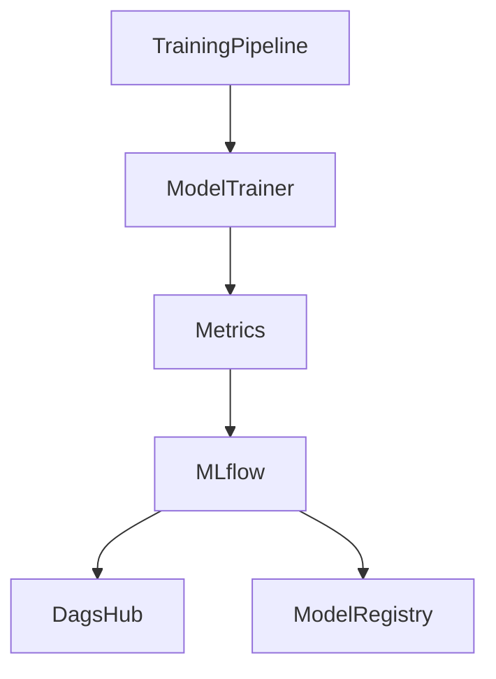
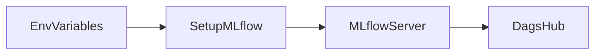
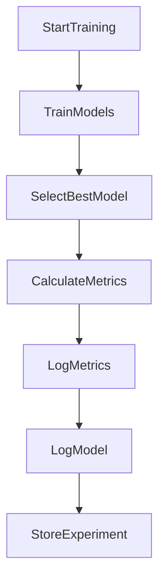
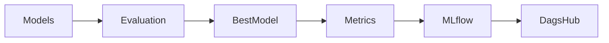
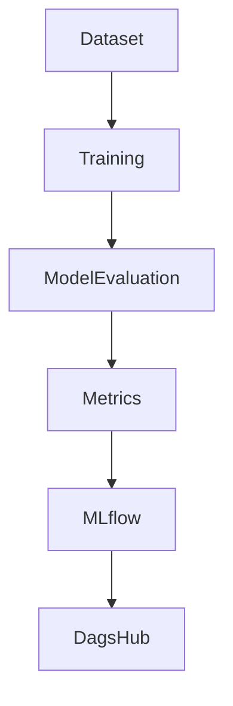
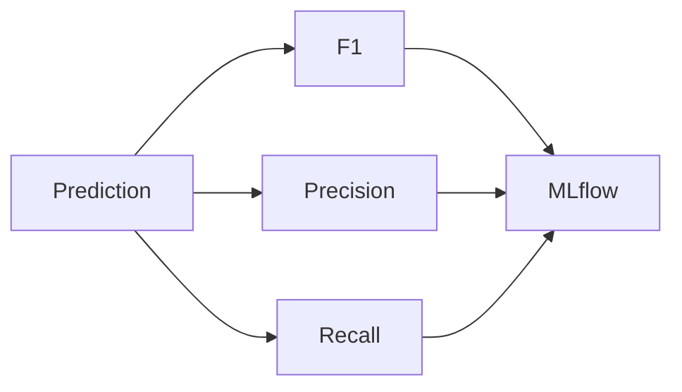
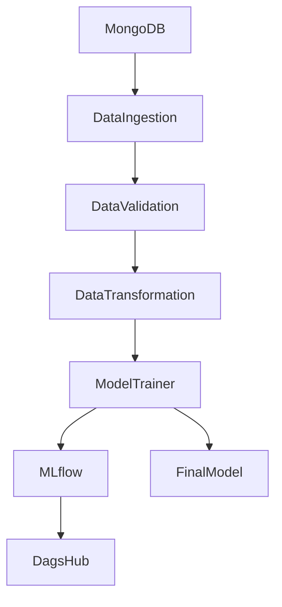

# MLflow Experiment Tracking

## Executive Summary

Experiment tracking is a critical component of the MLOps lifecycle. In this project, MLflow is integrated with DagsHub to track model performance metrics, compare experiments, and store trained models for reproducibility.

The tracking system enables monitoring of model quality across different training runs while maintaining a centralized experiment history.

---

# Objectives

The experiment tracking layer is responsible for:

* Tracking model performance metrics
* Comparing multiple training runs
* Logging trained models
* Maintaining experiment history
* Supporting reproducibility
* Providing centralized experiment storage through DagsHub

---

# Technology Stack

| Component | Purpose              |
| --------- | -------------------- |
| MLflow    | Experiment Tracking  |
| DagsHub   | Remote MLflow Server |
| GitHub    | Source Control       |
| FastAPI   | Model Serving        |
| Streamlit | User Interface       |

---

# Architecture Overview



---

# Source Files

## Model Trainer

```text
src/network_security_mlops/components/model_trainer.py
```

---

## Metric Calculation

```text
src/network_security_mlops/utils/ml_utils/metric/classification_metric.py
```

---

## Configuration

```text
.env
```

---

## Dependencies

```text
pyproject.toml
```

---

# Dependency Configuration

The project includes:

```toml
mlflow>=2.2.2
dagshub>=0.7.0
```

These libraries enable experiment tracking and remote storage.

---

# Environment Variables

MLflow configuration is provided using environment variables.

```env
MLFLOW_TRACKING_URI=
MLFLOW_TRACKING_USERNAME=
MLFLOW_TRACKING_PASSWORD=
ENABLE_MLFLOW=true
```

---

# MLflow Initialization

Location:

```python
src/network_security_mlops/components/model_trainer.py
```

---

## DagsHub Initialization

```python
dagshub.init(
    repo_owner="inglesantosh09",
    repo_name="network-security-mlops",
    mlflow=True
)
```

This establishes communication between MLflow and DagsHub.

---

# MLflow Setup Flow



---

# Runtime Configuration

The project dynamically loads tracking credentials.

```python
mlflow_uri = os.getenv("MLFLOW_TRACKING_URI")

mlflow_user = os.getenv("MLFLOW_TRACKING_USERNAME")

mlflow_password = os.getenv("MLFLOW_TRACKING_PASSWORD")
```

These values are injected during execution.

---

# Experiment Lifecycle

Every training run follows the same lifecycle.



---

# Metrics Captured

The project tracks classification metrics.

Location:

```text
src/network_security_mlops/utils/ml_utils/metric/classification_metric.py
```

---

## F1 Score

Measures the balance between precision and recall.

```python
f1_score(y_true, y_pred)
```

---

## Precision Score

Measures prediction accuracy for positive predictions.

```python
precision_score(y_true, y_pred)
```

---

## Recall Score

Measures the ability to detect phishing samples.

```python
recall_score(y_true, y_pred)
```

---

# Metric Artifact

Metrics are stored inside:

```python
ClassificationMetricArtifact
```

Structure:

```python
ClassificationMetricArtifact(
    f1_score=float,
    precision_score=float,
    recall_score=float
)
```

---

# Metrics Logging

Metrics are logged using:

```python
mlflow.log_metric(
    "f1_score",
    classification_metric.f1_score
)

mlflow.log_metric(
    "precision_score",
    classification_metric.precision_score
)

mlflow.log_metric(
    "recall_score",
    classification_metric.recall_score
)
```

---

# Model Logging

After selecting the best model:

```python
mlflow.sklearn.log_model(
    best_model,
    "model"
)
```

The trained model is uploaded to MLflow.

---

# Training Run Workflow



---

# Models Evaluated

The training pipeline evaluates multiple algorithms.

```text
Random Forest

Decision Tree

Gradient Boosting

Logistic Regression

AdaBoost
```

---

# Hyperparameter Optimization

Some models use GridSearchCV.

Examples:

## Random Forest

```python
{
    "n_estimators":
    [8,16,32,128,256]
}
```

---

## Decision Tree

```python
{
    "criterion":
    [
        "gini",
        "entropy",
        "log_loss"
    ]
}
```

---

## Gradient Boosting

```python
{
    "learning_rate": [...],
    "subsample": [...],
    "n_estimators": [...]
}
```

---

# Best Model Selection

After evaluation:

```python
best_model_score = max(
    sorted(model_report.values())
)
```

The model with highest test accuracy becomes the deployment candidate.

---

# Experiment Data Flow



---

# Local Model Storage

In addition to MLflow, the project stores artifacts locally.

```text
Artifacts/
```

and

```text
final_model/
├── model.joblib
└── preprocessor.joblib
```

---

# Why Use Both MLflow and Local Storage

Local storage provides:

* Fast inference
* Immediate deployment
* Offline access

MLflow provides:

* Experiment history
* Model comparison
* Reproducibility
* Centralized tracking

---

# Training Metrics Flow



---

# DagsHub Integration

DagsHub acts as:

* Remote MLflow Server
* Experiment Dashboard
* Artifact Store
* Team Collaboration Platform

---

# Benefits of DagsHub

### Centralized Tracking

All experiments are stored remotely.

### Reproducibility

Every run is preserved.

### Collaboration

Multiple developers can access results.

### Versioning

Training history remains available.

---

# Current Implementation

Current MLflow integration tracks:

✅ F1 Score

✅ Precision Score

✅ Recall Score

✅ Best Model

✅ Experiment Runs

✅ DagsHub Storage

---

# Current Limitations

⚠ Dataset version not logged

⚠ Hyperparameters not logged

⚠ Feature statistics not logged

⚠ Training duration not logged

⚠ Model signature not logged

⚠ Model Registry not used

---

# Recommended Improvements

## Log Hyperparameters

```python
mlflow.log_params(params)
```

---

## Log Training Dataset Information

```python
mlflow.log_param(
    "train_rows",
    len(train_df)
)
```

---

## Log Selected Model Name

```python
mlflow.log_param(
    "best_model",
    best_model_name
)
```

---

## Log Accuracy Scores

```python
mlflow.log_metric(
    "accuracy",
    accuracy_score
)
```

---

## Log Confusion Matrix

Store confusion matrix as an artifact.

---

## Enable Model Registry

Promote models through:

```text
Staging

Production

Archived
```

---

# Complete Tracking Architecture



---

# Summary

The experiment tracking layer integrates MLflow and DagsHub to provide centralized experiment management for the Network Security MLOps project. During model training, classification metrics and trained models are automatically logged, enabling experiment comparison, reproducibility, and future model governance. This layer forms the foundation for production-grade MLOps practices by maintaining a complete history of model performance across training runs.
