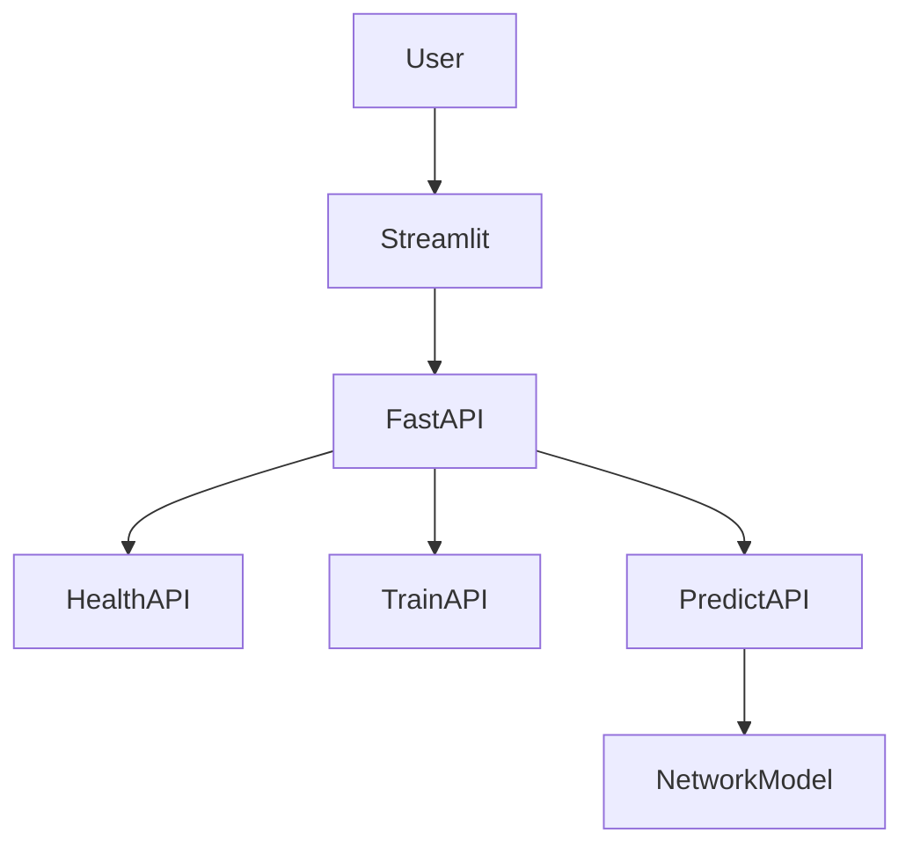
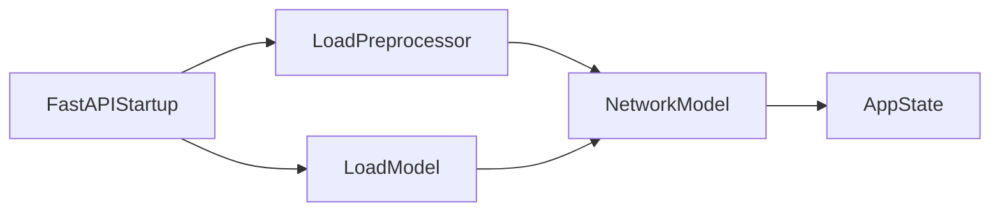
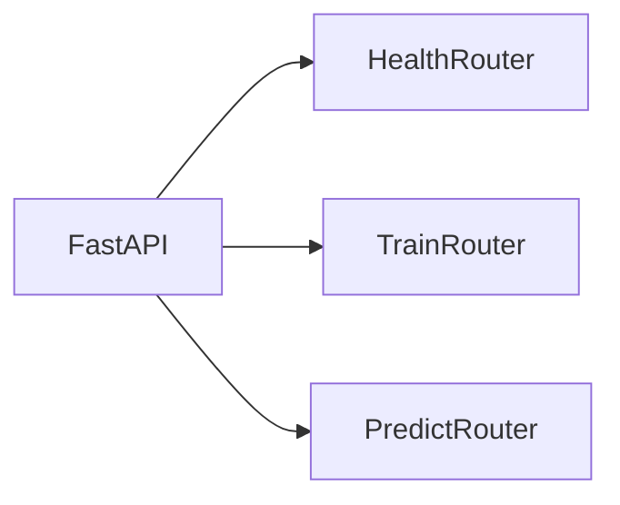
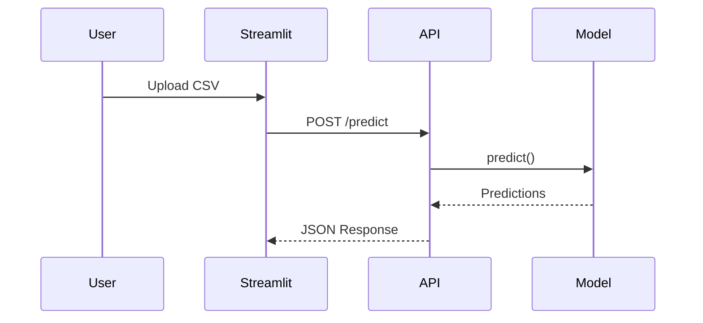
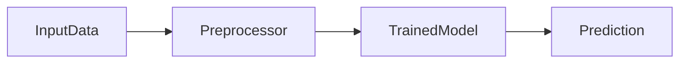
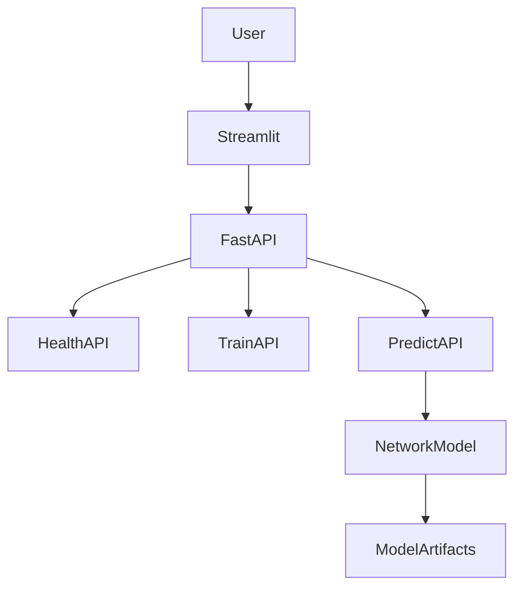
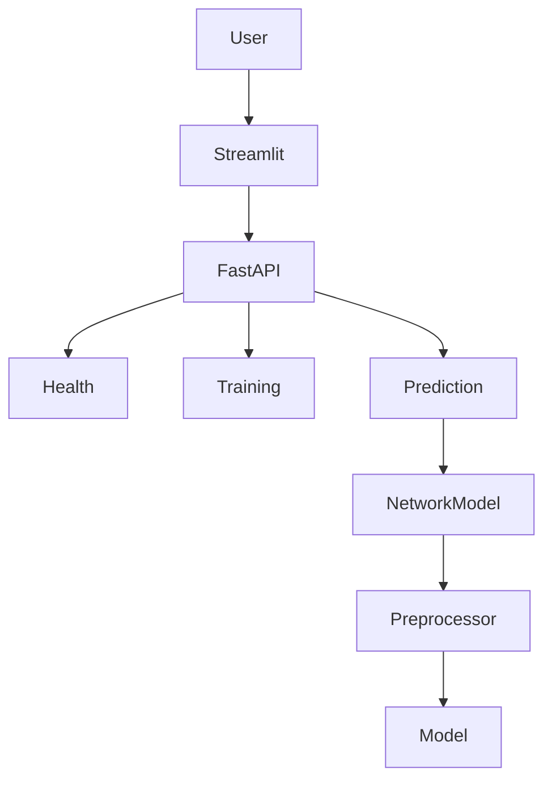

# API Layer

## Executive Summary

The API layer acts as the serving backbone of the Network Security MLOps platform. It exposes REST endpoints for model training, health monitoring, and phishing URL prediction while maintaining a clean separation between the frontend application and machine learning components.

The API is built using FastAPI and serves as the communication bridge between Streamlit and the trained machine learning model.

---

# Objectives

The API layer is responsible for:

* Serving predictions
* Triggering model training
* Health monitoring
* Loading model artifacts
* Managing inference requests
* Returning prediction results
* Supporting frontend integration

---

# Technology Stack

| Component    | Purpose            |
| ------------ | ------------------ |
| FastAPI      | REST API Framework |
| Uvicorn      | ASGI Server        |
| Pandas       | CSV Processing     |
| Scikit-Learn | Model Inference    |
| Streamlit    | Frontend Consumer  |
| Joblib       | Model Loading      |

---

# Source Files

## Main Application

```text
api/app.py
```

---

## Prediction Router

```text
api/routers/predict.py
```

---

## Training Router

```text
api/routers/train.py
```

---

## Health Router

```text
api/routers/health.py
```

---

## Model Wrapper

```text
src/network_security_mlops/utils/ml_utils/model/estimator.py
```

---

# High-Level Architecture



---

# FastAPI Application Lifecycle

Location:

```python
api/app.py
```

The application uses a lifespan manager.

```python
@asynccontextmanager
async def lifespan(app: FastAPI):
```

This ensures model artifacts are loaded once during startup.

---

# Startup Workflow



---

# Model Loading Process

During startup:

```python
app.state.model = NetworkModel(
    preprocessor=load_object(
        Path("final_model") / "preprocessor.joblib"
    ),
    model=load_object(
        Path("final_model") / "model.joblib"
    )
)
```

Loaded artifacts:

```text
final_model/
├── model.joblib
└── preprocessor.joblib
```

---

# Why Load Once?

Without startup loading:

```text
Request
  ↓
Load Model
  ↓
Predict
```

Every request causes disk access.

Current implementation:

```text
Startup
  ↓
Load Once
  ↓
Memory
  ↓
Reuse
```

Benefits:

* Lower latency
* Faster predictions
* Reduced I/O
* Better scalability

---

# Router Architecture



---

# Health Router

Location:

```text
api/routers/health.py
```

---

## Endpoint

```http
GET /health
```

---

## Response

```json
{
  "status": "healthy"
}
```

---

## Purpose

Used for:

* Container health checks
* Monitoring
* Deployment validation
* Load balancer probes

---

# Root Endpoint

```http
GET /
```

---

## Behavior

Redirects users to:

```text
/docs
```

FastAPI automatically generates Swagger documentation.

---

# Swagger Documentation

Available at:

```text
http://localhost:8000/docs
```

Provides:

* Endpoint discovery
* Request testing
* Response inspection

---

# Training Router

Location:

```text
api/routers/train.py
```

---

## Endpoint

```http
GET /train
```

---

## Purpose

Triggers a complete retraining process.

---

# Training Workflow


---

# Training Execution

```python
TrainingPipeline().run_pipeline()
```

This executes the entire training pipeline.

---

# Training Response

```text
Training completed successfully
```

---

# Prediction Router

Location:

```text
api/routers/predict.py
```

---

## Endpoint

```http
POST /predict
```

---

## Input

Multipart file upload.

```text
CSV File
```

---

# Prediction Request Flow



---

# CSV Processing

Uploaded file:

```python
dataframe = pd.read_csv(file.file)
```

Converted into:

```text
Pandas DataFrame
```

---

# Prediction Execution

Model retrieved from memory:

```python
network_model = request.app.state.model
```

Prediction:

```python
network_model.predict(dataframe)
```

---

# NetworkModel Architecture



---

# Prediction Pipeline

Inside:

```python
NetworkModel.predict()
```

Execution:

```python
x_transform =
preprocessor.transform(x)

prediction =
model.predict(x_transform)
```

---

# Response Generation

Predictions are added:

```python
dataframe["predicted_column"]
```

Output:

```text
Original Features
+
Prediction Column
```

---

# Output Storage

Each request generates a unique file.

```python
output_<uuid>.csv
```

Stored inside:

```text
prediction_output/
```

---

# Output Architecture


---

# Response Structure

```json
{
  "status": "success",
  "total_records": 100,
  "output_file": "...",
  "predictions": [],
  "data": []
}
```

---

# CORS Configuration

Configured in:

```python
app.add_middleware(
    CORSMiddleware,
    allow_origins=["*"],
    allow_credentials=True,
    allow_methods=["*"],
    allow_headers=["*"]
)
```

---

# Purpose of CORS

Allows:

* Streamlit access
* Browser requests
* Cross-origin communication

---

# Logging Strategy

Important events logged:

```text
Loading model and preprocessor

Model loaded successfully

Starting training pipeline

Reading uploaded file

Running predictions

Prediction saved

Shutting down
```

---

# Exception Handling

All routers use:

```python
NetworkSecurityException
```

Benefits:

* Standardized errors
* File tracking
* Line number tracking
* Easier debugging

---

# API Communication Architecture



---

# Security Considerations

Current implementation:

✅ Request isolation

✅ Unique output files

✅ Health monitoring

✅ Centralized logging

---

Current limitations:

⚠ No authentication

⚠ No API keys

⚠ No rate limiting

⚠ No request validation schema

⚠ No role-based access control

---

# Recommended Improvements

## Add Pydantic Schemas

Validate incoming requests.

---

## Add Authentication

Protect training endpoint.

---

## Add Rate Limiting

Prevent API abuse.

---

## Add Prediction Metadata

Track:

* Request ID
* Timestamp
* Model Version

---

## Add Monitoring

Integrate:

* Prometheus
* Grafana
* OpenTelemetry

---

# Complete API Architecture



---

# Summary

The API layer provides the serving foundation of the Network Security MLOps platform. Built using FastAPI, it manages model loading, training orchestration, health monitoring, and prediction serving. By loading artifacts once during startup and exposing clean REST endpoints, the API layer enables scalable and efficient interaction between the Streamlit frontend and machine learning backend.
