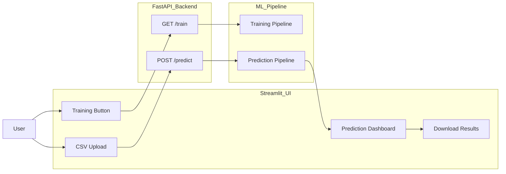
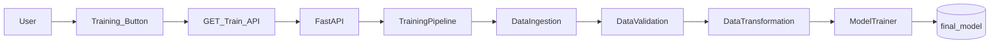
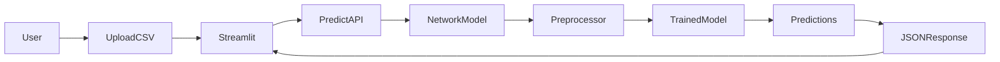
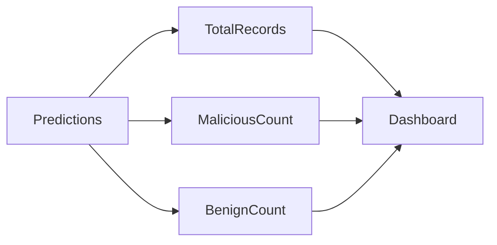
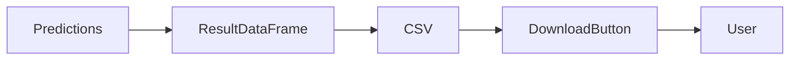
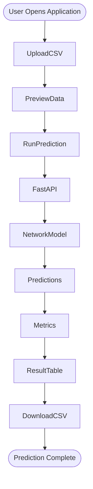

# 09. Streamlit Application

## Overview

The Streamlit application serves as the user-facing interface of the Network Security MLOps project.

Instead of interacting directly with APIs, users can:

- Trigger model training
- Upload phishing datasets
- Run batch predictions
- View prediction summaries
- Download prediction results

The Streamlit UI communicates with the FastAPI backend through HTTP requests and provides a simple workflow for non-technical users.

---

## Objective

The Streamlit layer provides:

- User-friendly interface
- Training pipeline trigger
- CSV upload functionality
- Batch prediction execution
- Prediction visualization
- Result download capability

---

## Source Files

### Main Application

```text
streamlit_app/
└── app.py
```

### Backend APIs Consumed

```text
api/
├── app.py
└── routers/
    ├── train.py
    ├── predict.py
    └── health.py
```

---

## Application Architecture



---

# Application Initialization

## Streamlit Configuration

```python
st.set_page_config(
    page_title="Network Security - Phishing Detection",
    page_icon="🛡️",
    layout="wide",
)
```

This configures:

- Browser tab title
- Application icon
- Wide screen layout

---

# Sidebar Module

The sidebar provides operational controls for training.

---

## Training Pipeline Trigger

```python
if st.button("▶ Run Training Pipeline"):
```

When clicked:

```python
requests.get(f"{API_BASE}/train")
```

calls

```http
GET /train
```

which triggers:

```text
TrainingPipeline.run_pipeline()
```

---

## Training Flow



---

# CSV Upload Module

The main section allows users to upload datasets for prediction.

```python
uploaded_file = st.file_uploader(
    "Choose a CSV file",
    type=["csv"]
)
```

Supported format:

```text
CSV
```

Requirements:

- Same schema used during training
- Feature columns only
- No preprocessing required from user

---

# Dataset Preview

Before prediction:

```python
preview_df = pd.read_csv(uploaded_file)
```

Streamlit displays:

```python
st.dataframe(preview_df.head())
```

along with:

- Row count
- Column count

This helps users validate uploaded data.

---

# Prediction Workflow

## Trigger Prediction

```python
if st.button("Run Predictions"):
```

Streamlit sends:

```python
requests.post(
    f"{API_BASE}/predict",
    files={"file": uploaded_file}
)
```

to FastAPI.

---

## Prediction Architecture



---

# Prediction Results Processing

The API returns:

```json
{
  "status": "success",
  "total_records": 100,
  "predictions": [...],
  "data": [...]
}
```

Streamlit converts response into:

```python
result_df = pd.DataFrame(result["data"])
```

---

# Metrics Dashboard

The application calculates:

```python
malicious = (
    result_df["predicted_column"] == 1
).sum()
```

and displays:

- Total Records
- Malicious URLs
- Benign URLs

using:

```python
st.metric()
```

---

## Metrics Flow



---

# Prediction Table

Results are displayed using:

```python
st.dataframe()
```

Example:

| URL Feature Set | Prediction |
|-----------------|------------|
| Record 1 | 1 |
| Record 2 | 0 |
| Record 3 | 1 |

Where:

```text
1 = Malicious
0 = Benign
```

---

# Result Download Feature

Users can export prediction results.

```python
st.download_button(
    label="Download Results CSV"
)
```

Generated file:

```text
predictions.csv
```

contains:

- Original features
- Prediction column

---

## Download Flow



---

# API Communication Layer

The Streamlit application communicates with FastAPI using:

```python
requests.get()
```

and

```python
requests.post()
```

Backend URL:

```python
API_BASE = os.getenv(
    "API_BASE_URL",
    "http://localhost:8000"
)
```

This allows:

- Local development
- Docker deployment
- Cloud deployment

without code changes.

---

# Error Handling

The UI gracefully handles:

## API Unavailable

```python
Could not reach API
```

---

## Training Failure

```python
Training failed
```

---

## Prediction Failure

```python
Prediction failed
```

---

# End-to-End User Journey



---

# Key Components Used

| Component | Purpose |
|------------|----------|
| Streamlit | Frontend UI |
| Requests | API Communication |
| Pandas | CSV Handling |
| FastAPI | Backend Service |
| NetworkModel | Prediction Engine |
| Preprocessor | Feature Transformation |
| Trained Model | Classification |

---

# Artifacts Used

```text
final_model/
├── model.joblib
└── preprocessor.joblib
```

Loaded by FastAPI during startup and used by Streamlit indirectly through API calls.

---

# Stage Output

### User Capabilities

- Trigger model training
- Upload datasets
- Run phishing detection
- View prediction metrics
- Download results

### System Benefits

- No command line usage required
- User-friendly interface
- Batch prediction support
- API-driven architecture
- Production-ready frontend