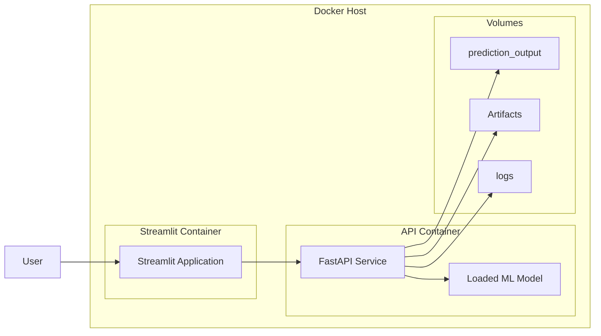
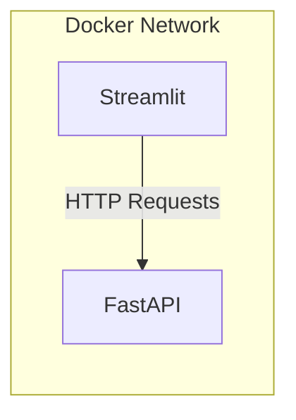
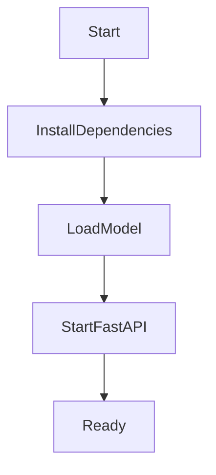
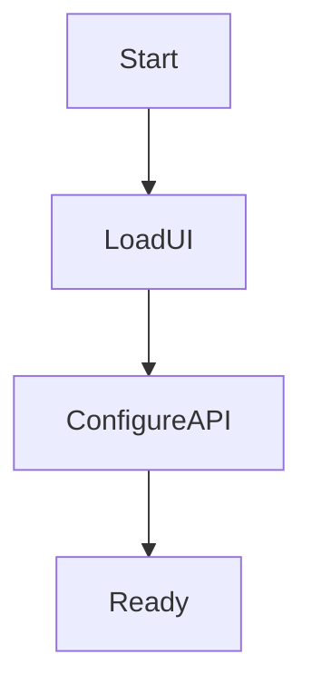
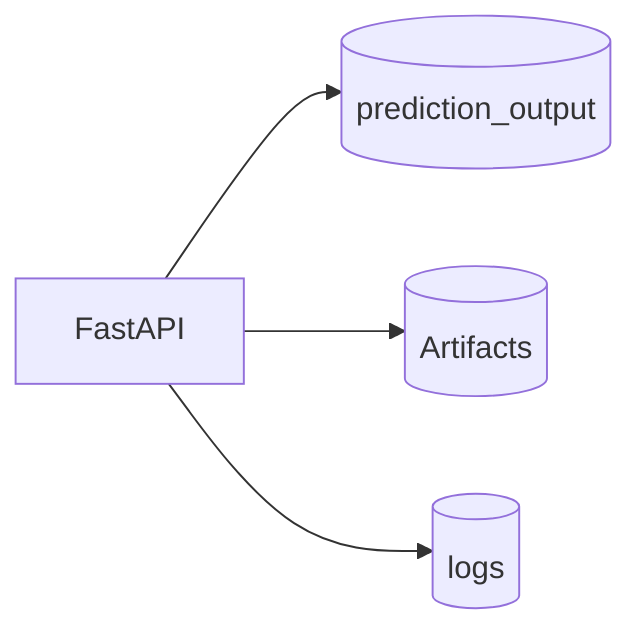
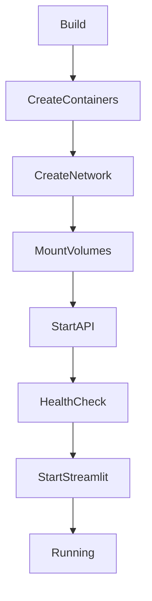
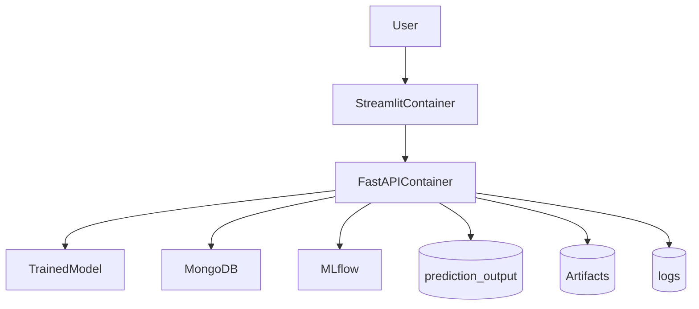

# 10. Docker Containerization

## Overview

To ensure portability, reproducibility, and deployment consistency, the Network Security MLOps project is fully containerized using Docker.

The application is split into two independent services:

1. FastAPI Backend Service
2. Streamlit Frontend Service

Docker Compose orchestrates both containers and manages networking, storage, and service dependencies.

---

# Objectives

Containerization provides:

* Environment consistency
* Dependency isolation
* Easy deployment
* Horizontal scalability
* Simplified local development
* Cloud portability

---

# Source Files

```text
Dockerfile.api
Dockerfile.ui
docker-compose.yml
```

---

# High-Level Container Architecture



---

# Docker Compose Architecture

The entire application is orchestrated using:

```text
docker-compose.yml
```

Services:

```yaml
services:
  api:
  streamlit:
```

---

# Container Communication

The Streamlit container communicates with FastAPI using Docker internal DNS.

```yaml
API_BASE_URL=http://api:8000
```

Here:

```text
api
```

is the Docker service name.

Docker automatically resolves:

```text
http://api:8000
```

to the FastAPI container.

---

# Internal Networking



No external networking configuration is required.

Docker Compose automatically creates:

```text
default bridge network
```

for all services.

---

# API Container

## Dockerfile

```text
Dockerfile.api
```

---

## Base Image

```dockerfile
FROM python:3.11
```

Provides:

* Python runtime
* Linux environment
* Package installation support

---

## Working Directory

```dockerfile
WORKDIR /app
```

All subsequent operations execute inside:

```text
/app
```

---

## Dependency Installation

```dockerfile
COPY requirements.txt .
RUN pip install -r requirements.txt
```

Installs:

* FastAPI
* Scikit-learn
* MLflow
* Pandas
* NumPy
* PyMongo
* Other project dependencies

---

## Source Code Copy

```dockerfile
COPY src/ ./src/
COPY api/ ./api/
COPY pipelines/ ./pipelines/
COPY configs/ ./configs/
COPY final_model/ ./final_model/
```

Copies application source into container.

---

## Python Path

```dockerfile
ENV PYTHONPATH=/app/src
```

Allows imports such as:

```python
from network_security_mlops...
```

---

## Exposed Port

```dockerfile
EXPOSE 8000
```

FastAPI listens on:

```text
8000
```

---

## Startup Command

```dockerfile
CMD [
 "uvicorn",
 "api.app:app",
 "--host",
 "0.0.0.0",
 "--port",
 "8000"
]
```

Starts the API service.

---

# API Container Startup Flow



---

# Model Loading

During FastAPI startup:

```python
app.state.model = NetworkModel(
    preprocessor=load_object(...),
    model=load_object(...)
)
```

Models are loaded once and reused across requests.

Benefits:

* Reduced latency
* No repeated disk reads
* Improved throughput

---

# Streamlit Container

## Dockerfile

```text
Dockerfile.ui
```

---

## Base Image

```dockerfile
FROM python:3.11
```

---

## Dependency Installation

```dockerfile
COPY requirements.txt .
RUN pip install -r requirements.txt
```

---

## UI Source Code

```dockerfile
COPY streamlit_app/ ./streamlit_app/
```

Only frontend code is copied.

---

## Exposed Port

```dockerfile
EXPOSE 8501
```

Default Streamlit port.

---

## Startup Command

```dockerfile
CMD [
 "streamlit",
 "run",
 "streamlit_app/app.py"
]
```

Starts the user interface.

---

# Streamlit Startup Flow



---

# Volume Management

Persistent data is stored using Docker volumes.

---

## Prediction Output Volume

```yaml
prediction_output:
```

Stores:

```text
prediction_output/
```

Generated prediction CSV files.

---

## Artifact Volume

```yaml
artifacts:
```

Stores:

```text
Artifacts/
```

Pipeline artifacts including:

* Train/Test datasets
* Drift reports
* Numpy arrays
* Trained models

---

## Log Volume

```yaml
logs:
```

Stores:

```text
logs/
```

Application logs.

---

# Volume Architecture



---

# Health Checks

The API service exposes:

```http
GET /health
```

Response:

```json
{
  "status":"healthy"
}
```

---

## Docker Health Check

```yaml
healthcheck:
  test:
    ["CMD","curl","-f","http://localhost:8000/health"]
```

Docker continuously monitors API availability.

---

# Service Dependency Management

```yaml
depends_on:
  api:
    condition: service_healthy
```

The Streamlit container starts only after:

```text
FastAPI is healthy
```

This prevents startup race conditions.

---

# Environment Variables

Configuration is injected using:

```yaml
env_file:
  - .env
```

Common variables:

```text
MONGO_DB_URL
MLFLOW_TRACKING_URI
MLFLOW_TRACKING_USERNAME
MLFLOW_TRACKING_PASSWORD
ENABLE_MLFLOW
```

Benefits:

* No hardcoded secrets
* Environment-specific configuration
* Easier cloud deployment

---

# Container Lifecycle



---

# Local Development Workflow

Build containers:

```bash
docker compose build
```

Start containers:

```bash
docker compose up
```

Stop containers:

```bash
docker compose down
```

View logs:

```bash
docker compose logs -f
```

---

# Production Benefits

Docker enables:

* Consistent environments
* Easy deployment
* Infrastructure portability
* Faster onboarding
* Simplified scaling
* Reduced configuration drift

---

# Containerized System Architecture



---

# Stage Outputs

## Infrastructure Components

* Dockerfile.api
* Dockerfile.ui
* docker-compose.yml

## Running Containers

* FastAPI Backend
* Streamlit Frontend

## Persistent Storage

* prediction_output
* Artifacts
* logs

## Deployment Ready

The complete application can be deployed using a single command:

```bash
docker compose up
```
