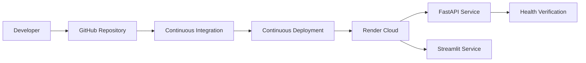
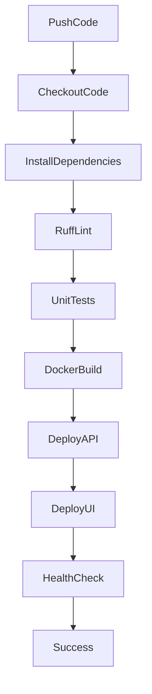
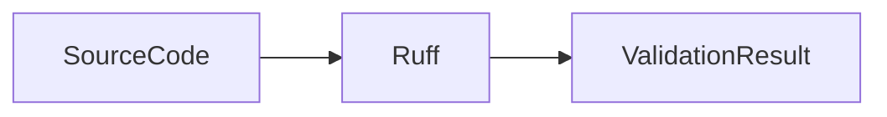
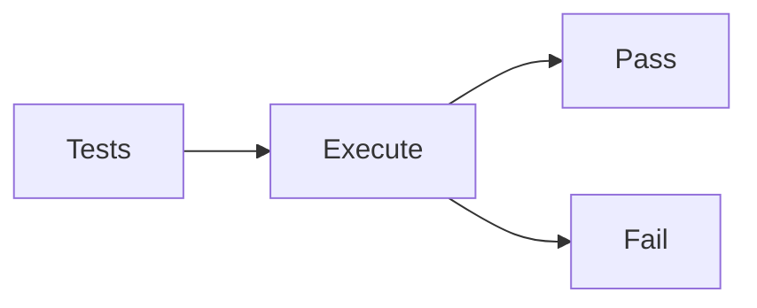
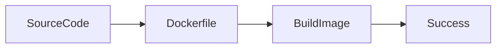
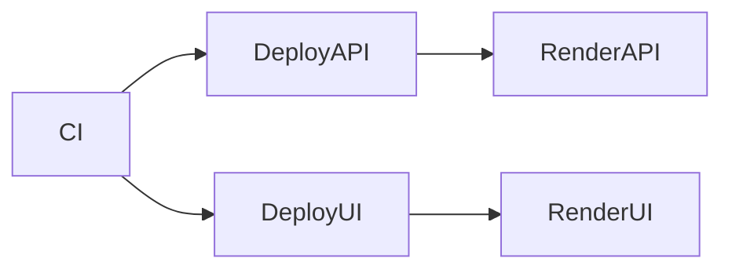
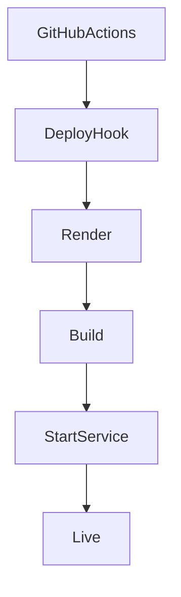
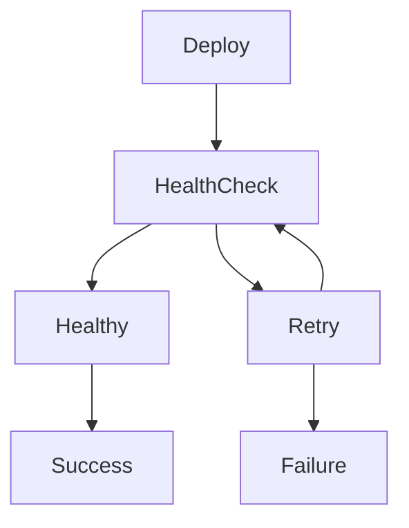
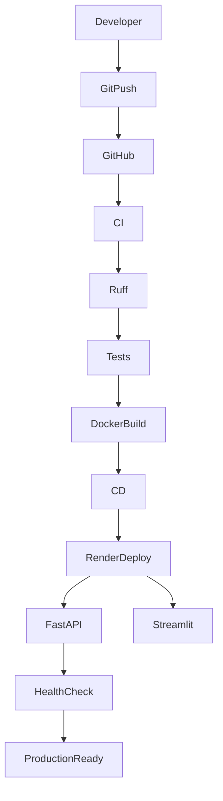

# 11. GitHub Actions CI/CD Pipeline

## Overview

To automate software delivery and maintain deployment quality, the Network Security MLOps project uses GitHub Actions for Continuous Integration (CI) and Continuous Deployment (CD).

Every push to the `main` branch automatically triggers:

1. Code Validation
2. Dependency Installation
3. Static Code Analysis
4. Unit Test Execution
5. Docker Image Build
6. Deployment to Render
7. Post-Deployment Health Verification

This eliminates manual deployment steps and ensures that production environments always run validated code.

---

# Objectives

The CI/CD pipeline provides:

* Automated quality checks
* Continuous integration
* Continuous deployment
* Faster release cycles
* Consistent deployments
* Production health monitoring

---

# Source File

```text
.github/
└── workflows/
    └── main.yaml
```

---

# Pipeline Architecture



---

# Workflow Trigger

The pipeline starts automatically when code is pushed to:

```yaml
on:
  push:
    branches:
      - main
```

---

## Ignored Files

```yaml
paths-ignore:
  - README.md
```

Changes to documentation do not trigger deployment.

---

# Workflow Structure

The workflow contains two stages:

```text
1. Continuous Integration
2. Continuous Deployment
```

---

# Complete Pipeline Flow



---

# Continuous Integration (CI)

The CI stage validates code quality before deployment.

---

## Runner Environment

```yaml
runs-on: ubuntu-latest
```

GitHub provisions a fresh Linux VM.

---

## Repository Checkout

```yaml
uses: actions/checkout@v4
```

Downloads source code into the runner.

---

## Python Environment Setup

```yaml
uses: actions/setup-python@v5
```

Configured Version:

```yaml
python-version: '3.11'
```

---

# Dependency Installation

```yaml
pip install -r requirements.txt
pip install ruff pytest
```

Installs:

* FastAPI
* Streamlit
* MLflow
* Scikit-learn
* Ruff
* Pytest

and all project dependencies.

---

# Static Code Analysis

## Ruff Linter

```yaml
ruff check . --select E,F --ignore E501
```

Validates:

* Syntax errors
* Import errors
* Undefined variables
* Common Python issues

---

## CI Validation Flow



---

# Unit Testing

```yaml
pytest tests/unit/ -v --tb=short
```

Purpose:

* Verify functionality
* Catch regressions
* Ensure stable releases

---

## Test Execution Flow



Deployment only continues if tests pass.

---

# Docker Image Validation

The CI stage verifies that containers can be built successfully.

```yaml
docker build -f Dockerfile.api -t netsec-api .
```

This validates:

* Dockerfile syntax
* Dependency installation
* Container startup requirements

---

## Docker Validation Flow



---

# CI Environment Variables

GitHub Secrets are injected securely:

```yaml
env:
  MLFLOW_TRACKING_URI
  MLFLOW_TRACKING_USERNAME
  MLFLOW_TRACKING_PASSWORD
```

Benefits:

* No hardcoded credentials
* Secure storage
* Environment isolation

---

# Continuous Deployment (CD)

Deployment starts only after CI succeeds.

```yaml
needs: integration
```

This creates a dependency chain:

```text
CI Success → Deployment
```

---

# Deployment Architecture



---

# Render Deployment

The project uses Render Deploy Hooks.

---

## API Deployment

```yaml
curl -X POST $RENDER_DEPLOY_HOOK_API
```

Triggers:

```text
FastAPI deployment
```

---

## Streamlit Deployment

```yaml
curl -X POST $RENDER_DEPLOY_HOOK_UI
```

Triggers:

```text
Streamlit deployment
```

---

# Render Deployment Flow



---

# Post Deployment Health Verification

After deployment:

```yaml
GET /health
```

is called repeatedly.

---

## Health Check Logic

```bash
curl ${RENDER_API_URL}/health
```

Expected Response:

```json
{
  "status": "healthy"
}
```

---

# Health Check Retry Strategy

The workflow performs:

```text
12 Attempts
15 Seconds Interval
```

Maximum wait time:

```text
180 Seconds
```

---

## Health Validation Flow



---

# GitHub Secrets Management

The pipeline relies on encrypted repository secrets.

---

## MLflow Secrets

```text
MLFLOW_TRACKING_URI
MLFLOW_TRACKING_USERNAME
MLFLOW_TRACKING_PASSWORD
```

Used for:

* Experiment tracking
* Model logging

---

## Render Secrets

```text
RENDER_DEPLOY_HOOK_API
RENDER_DEPLOY_HOOK_UI
RENDER_API_URL
```

Used for:

* Automated deployment
* Health monitoring

---

# Branch-Based Deployment Strategy

Current Strategy:

```text
main branch
    ↓
CI
    ↓
CD
    ↓
Production
```

---

# End-to-End Release Lifecycle



---

# Benefits of GitHub Actions

## Development Benefits

* Automated testing
* Faster feedback
* Reduced manual effort
* Consistent builds

---

## Operations Benefits

* Automated deployment
* Health monitoring
* Secure secret management
* Deployment traceability

---

## MLOps Benefits

* Production-ready workflows
* Reproducible releases
* Infrastructure automation
* Continuous delivery

---

# Stage Outputs

## CI Deliverables

* Source Validation
* Dependency Verification
* Ruff Lint Checks
* Unit Test Execution
* Docker Build Validation

---

## CD Deliverables

* Automated API Deployment
* Automated Streamlit Deployment
* Render Integration
* Health Verification

---

## Production Outcome

Every successful push to the `main` branch automatically:

1. Validates Code
2. Executes Tests
3. Builds Containers
4. Deploys Services
5. Verifies Application Health

without any manual intervention.
