# End-to-End Architecture

## Overview

This document explains the complete architecture of the Network Security MLOps project.

The project implements a production-grade machine learning system for phishing URL detection and covers the complete MLOps lifecycle:

* Data Ingestion from MongoDB
* Data Validation
* Data Transformation
* Model Training
* Experiment Tracking using MLflow + DagsHub
* Model Packaging
* FastAPI Serving Layer
* Streamlit User Interface
* Docker Containerization
* GitHub Actions CI/CD
* Render Deployment

---

# High-Level Architecture

```mermaid
flowchart LR

    %% ==============================
    %% DATA SOURCE
    %% ==============================

    subgraph Data_Source
        M["MongoDB"]
    end

    %% ==============================
    %% TRAINING PIPELINE
    %% ==============================

    subgraph Training_Pipeline
        DI["Data Ingestion"]
        DV["Data Validation"]
        DT["Data Transformation"]
        MT["Model Training"]
        MLF["MLflow Tracking"]
    end

    %% ==============================
    %% ARTIFACT STORAGE
    %% ==============================

    subgraph Artifact_Storage
        FS["Feature Store"]
        TR["train.csv"]
        TE["test.csv"]
        VA["Validated Data"]
        NPY["Transformed Numpy Arrays"]
        PRE["preprocessor.joblib"]
        MOD["model.joblib"]
    end

    %% ==============================
    %% FINAL MODEL
    %% ==============================

    subgraph Final_Model
        FM1["final_model/model.joblib"]
        FM2["final_model/preprocessor.joblib"]
    end

    %% ==============================
    %% FASTAPI
    %% ==============================

    subgraph FastAPI_Service
        API["FastAPI Application"]

        TRAIN["GET /train"]

        PREDICT["POST /predict"]

        HEALTH["GET /health"]
    end

    %% ==============================
    %% STREAMLIT
    %% ==============================

    subgraph Streamlit_UI
        UI["Streamlit Dashboard"]
        UPLOAD["Upload CSV"]
        RESULTS["Prediction Results"]
    end

    %% ==============================
    %% GITHUB ACTIONS
    %% ==============================

    subgraph GitHub_Actions
        GIT["GitHub Repository"]
        CI["Continuous Integration"]
        CD["Continuous Deployment"]
    end

    %% ==============================
    %% RENDER
    %% ==============================

    subgraph Render_Deployment
        RAPI["Render API Service"]
        RUI["Render Streamlit Service"]
    end

    %% ==============================
    %% TRAINING FLOW
    %% ==============================

    M --> DI

    DI --> FS

    DI --> TR
    DI --> TE

    TR --> DV
    TE --> DV

    DV --> VA

    VA --> DT

    DT --> NPY

    DT --> PRE

    NPY --> MT

    PRE --> MT

    MT --> MOD

    MT --> MLF

    MOD --> FM1

    PRE --> FM2

    %% ==============================
    %% PREDICTION FLOW
    %% ==============================

    FM1 --> API
    FM2 --> API

    TRAIN --> DI

    UI --> UPLOAD

    UPLOAD --> PREDICT

    PREDICT --> API

    API --> RESULTS

    RESULTS --> UI

    %% ==============================
    %% DEPLOYMENT FLOW
    %% ==============================

    GIT --> CI

    CI --> CD

    CD --> RAPI

    CD --> RUI

    RAPI --> API

    RUI --> UI
```



---

# End-to-End Training Workflow

## Step 1: Data Ingestion

**File**

```text
src/network_security_mlops/components/data_ingestion.py
```

### Responsibilities

* Connect to MongoDB
* Read phishing dataset
* Convert MongoDB collection into Pandas DataFrame
* Remove MongoDB generated `_id` column
* Standardize missing values
* Store raw dataset in Feature Store
* Split dataset into Train and Test sets

### Outputs

```text
Artifacts/
└── data_ingestion/
    ├── feature_store/
    │   └── phishingData.csv
    │
    └── ingested/
        ├── train.csv
        └── test.csv
```

---

## Step 2: Data Validation

**File**

```text
src/network_security_mlops/components/data_validation.py
```

### Responsibilities

* Validate schema columns
* Validate dataset structure
* Detect dataset drift using KS-Test
* Generate drift report

### Outputs

```text
Artifacts/
└── data_validation/
    ├── validated/
    │   ├── train.csv
    │   └── test.csv
    │
    └── drift_report/
        └── drift_report.yaml
```

---

## Step 3: Data Transformation

**File**

```text
src/network_security_mlops/components/data_transformation.py
```

### Responsibilities

* Separate Features and Target
* Convert target labels

```text
-1 → 0
1 → 1
```

* Apply KNN Imputer
* Transform train and test datasets
* Save preprocessing pipeline

### Outputs

```text
Artifacts/
└── data_transformation/
    ├── transformed/
    │   ├── train.npy
    │   └── test.npy
    │
    └── transformed_object/
        └── preprocessing.joblib
```

---

## Step 4: Model Training

**File**

```text
src/network_security_mlops/components/model_trainer.py
```

### Models Evaluated

* Random Forest
* Decision Tree
* Gradient Boosting
* Logistic Regression
* AdaBoost

### Responsibilities

* Hyperparameter tuning
* Model evaluation
* Best model selection
* Metrics generation
* Model serialization

### Outputs

```text
Artifacts/
└── model_trainer/
    └── trained_model/
        └── model.joblib
```

---

## Step 5: Experiment Tracking

### Tools

* MLflow
* DagsHub

### Metrics Logged

* F1 Score
* Precision Score
* Recall Score

### Artifacts Logged

* Trained Model
* Hyperparameters
* Experiment Runs

### Purpose

Provides:

* Experiment reproducibility
* Model comparison
* Run history
* Model versioning

---

## Step 6: Model Packaging

### Generated Assets

```text
final_model/
├── model.joblib
└── preprocessor.joblib
```

These files are loaded by FastAPI during application startup.

---

# Prediction Workflow

## FastAPI Startup

**File**

```text
api/app.py
```

### Startup Process

1. Load preprocessor.joblib
2. Load model.joblib
3. Create NetworkModel object
4. Store model in app.state

### Benefit

Avoids repeated disk reads for every prediction request.

---

## Prediction Flow

```text
CSV Upload
    ↓
FastAPI Endpoint
    ↓
Pandas DataFrame
    ↓
Preprocessor Transform
    ↓
Model Prediction
    ↓
Append Prediction Column
    ↓
JSON Response
```

---

# Streamlit Workflow

**File**

```text
streamlit_app/app.py
```

### Features

* Upload CSV
* Preview Dataset
* Run Batch Predictions
* Display Metrics
* Download Results

### Displayed Metrics

* Total Records
* Malicious URLs
* Benign URLs

---

# Docker Architecture

### Containers

#### FastAPI Container

```text
Dockerfile.api
```

Responsibilities:

* Load trained model
* Serve API requests
* Execute predictions

#### Streamlit Container

```text
Dockerfile.ui
```

Responsibilities:

* User Interface
* Visualization
* Prediction Requests

### Orchestration

```text
docker-compose.yml
```

Provides:

* Multi-container deployment
* Service communication
* Shared volumes
* Health checks

---

# CI/CD Workflow

### Source Control

```text
GitHub Repository
```

### Continuous Integration

```text
GitHub Push
      ↓
Checkout Code
      ↓
Install Dependencies
      ↓
Ruff Linting
      ↓
Unit Tests
      ↓
Docker Build Validation
```

### Continuous Deployment

```text
GitHub Actions
      ↓
Render Deploy Hook
      ↓
API Deployment
      ↓
UI Deployment
      ↓
Health Check Validation
```

---

# Deployment Architecture

### Platform

Render

### Services

* FastAPI Backend
* Streamlit Frontend

### Deployment Trigger

```text
GitHub Actions CD Pipeline
```

### Health Endpoint

```http
GET /health
```

---

# Complete System Flow

```text
MongoDB
    ↓
Data Ingestion
    ↓
Data Validation
    ↓
Data Transformation
    ↓
Model Training
    ↓
MLflow Tracking
    ↓
Model Packaging
    ↓
FastAPI Deployment
    ↓
Streamlit Dashboard
    ↓
Docker Containers
    ↓
GitHub Actions CI/CD
    ↓
Render Deployment
    ↓
User Predictions
```

---

# Technology Stack

| Layer               | Technology            |
| ------------------- | --------------------- |
| Database            | MongoDB               |
| Data Processing     | Pandas                |
| Validation          | SciPy KS-Test         |
| Transformation      | Scikit-Learn Pipeline |
| Imputation          | KNN Imputer           |
| Model Training      | Scikit-Learn          |
| Experiment Tracking | MLflow                |
| Experiment Registry | DagsHub               |
| API Layer           | FastAPI               |
| Frontend            | Streamlit             |
| Containerization    | Docker                |
| CI/CD               | GitHub Actions        |
| Deployment          | Render                |
| Serialization       | Joblib                |
| Language            | Python                |

---

# Final Outcome

The Network Security MLOps project delivers a complete production-ready machine learning system capable of:

* Automated model training
* Data validation and drift detection
* Feature preprocessing and transformation
* Experiment tracking with MLflow
* Model versioning
* FastAPI prediction serving
* Streamlit-based user interface
* Dockerized deployment
* Automated CI/CD with GitHub Actions
* Cloud deployment on Render

This architecture demonstrates the complete lifecycle of a modern MLOps system from raw data ingestion to real-time prediction serving.
