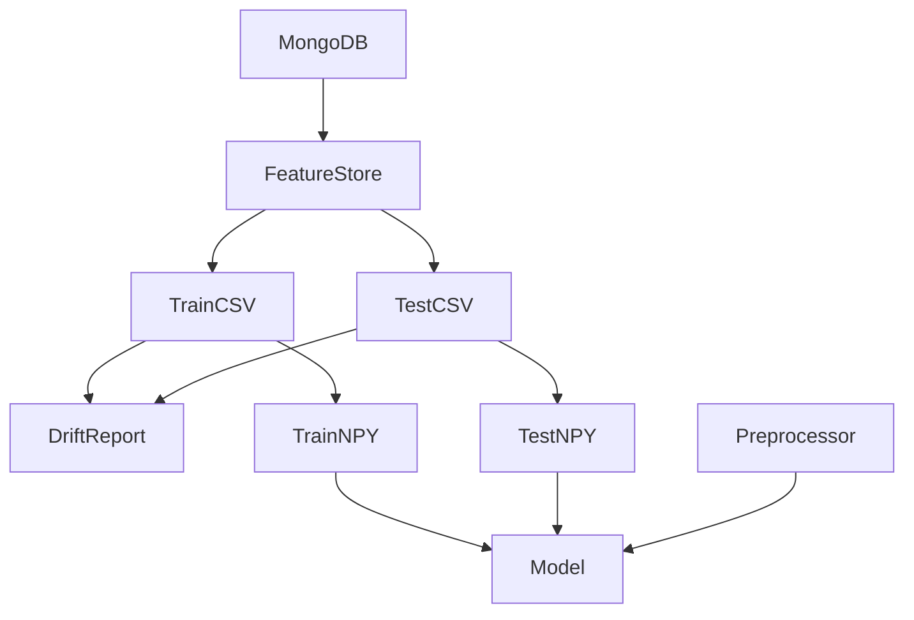
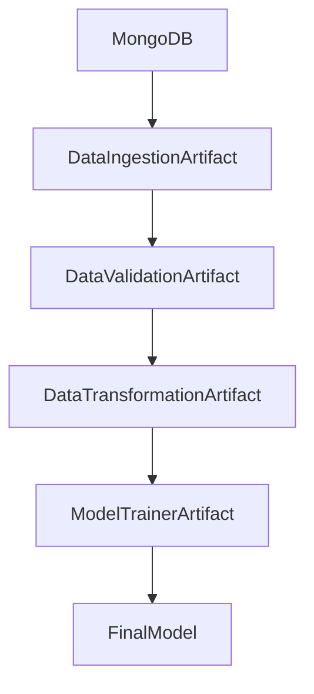

# 14. Artifact Management

## Overview

The Network Security MLOps project follows an **Artifact-Based Pipeline Architecture**.

Instead of directly passing DataFrames, models, or preprocessing objects between pipeline stages, each stage generates an artifact that stores:

* Output metadata
* File locations
* Validation status
* Model information
* Performance metrics

These artifacts act as contracts between pipeline components and ensure that every stage remains independent and reproducible.

---

# What is an Artifact?

An artifact is any file, object, model, report, or metadata generated during pipeline execution.

Examples:

* Training datasets
* Validation reports
* Numpy arrays
* Preprocessing objects
* Trained models
* Evaluation metrics

Artifacts allow:

* Reproducibility
* Traceability
* Versioning
* Experiment Tracking
* Debugging

---

# Artifact Architecture

```mermaid
flowchart LR

    DI[Data Ingestion]

    DIA[DataIngestionArtifact]

    DV[Data Validation]

    DVA[DataValidationArtifact]

    DT[Data Transformation]

    DTA[DataTransformationArtifact]

    MT[Model Trainer]

    MTA[ModelTrainerArtifact]

    DI --> DIA

    DIA --> DV

    DV --> DVA

    DVA --> DT

    DT --> DTA

    DTA --> MT

    MT --> MTA
```



Each component produces an artifact that becomes the input for the next stage.

---

# Artifact Storage Structure

Every pipeline execution creates a unique timestamped artifact directory.

Example:

```text
Artifacts/

└── 2026_06_11_14_30_45/

    ├── data_ingestion/

    ├── data_validation/

    ├── data_transformation/

    └── model_trainer/
```

Generated from:

```python
TrainingPipelineConfig
```

Location:

```text
src/network_security_mlops/entity/config_entity.py
```

Timestamp generation:

```python
timestamp.strftime("%Y_%m_%d_%H_%M_%S")
```

Example:

```text
Artifacts/2026_06_11_14_30_45/
```

This ensures every pipeline execution remains isolated.

---

# Training Pipeline Artifact Flow



---

# Data Ingestion Artifacts

## Purpose

Stores outputs generated during data ingestion.

---

## Directory Structure

```text
Artifacts/

└── timestamp/

    └── data_ingestion/

        ├── feature_store/

        │   └── phishingData.csv

        │

        └── ingested/

            ├── train.csv

            └── test.csv
```

---

## Generated Files

### Feature Store

```text
phishingData.csv
```

Contains:

* Raw MongoDB dataset
* Cleaned _id column removal
* Missing value normalization

Path:

```python
feature_store_file_path
```

---

### Training Dataset

```text
train.csv
```

Contains:

* 80% training records

Path:

```python
training_file_path
```

---

### Testing Dataset

```text
test.csv
```

Contains:

* 20% testing records

Path:

```python
testing_file_path
```

---

## DataIngestionArtifact

Defined in:

```text
src/network_security_mlops/entity/artifact_entity.py
```

Structure:

```python
@dataclass
class DataIngestionArtifact:
    trained_file_path: str
    test_file_path: str
```

Example:

```python
DataIngestionArtifact(
    trained_file_path="Artifacts/.../train.csv",
    test_file_path="Artifacts/.../test.csv"
)
```

---

# Data Validation Artifacts

## Purpose

Stores validation outputs and drift analysis results.

---

## Directory Structure

```text
Artifacts/

└── timestamp/

    └── data_validation/

        ├── validated/

        │   ├── train.csv

        │   └── test.csv

        │

        └── drift_report/

            └── drift_report.yaml
```

---

## Drift Report

Generated using:

```python
scipy.stats.ks_2samp()
```

Stores:

```yaml
URL_Length:
  p_value: 0.98
  drift_status: false

having_IP_Address:
  p_value: 0.91
  drift_status: false
```

Purpose:

* Detect schema changes
* Detect distribution shifts
* Identify model degradation risk

---

## DataValidationArtifact

Structure:

```python
@dataclass
class DataValidationArtifact:

    drift_validation_status: bool

    valid_train_file_path: str

    valid_test_file_path: str

    invalid_train_file_path: str

    invalid_test_file_path: str

    drift_report_file_path: str
```

---

# Data Transformation Artifacts

## Purpose

Stores transformed datasets and preprocessing objects.

---

## Directory Structure

```text
Artifacts/

└── timestamp/

    └── data_transformation/

        ├── transformed/

        │   ├── train.npy

        │   └── test.npy

        │

        └── transformed_object/

            └── preprocessing.joblib
```

---

## train.npy

Contains:

```text
Features + Target
```

After:

* KNN Imputation
* Missing Value Handling

---

## test.npy

Contains transformed testing dataset.

---

## preprocessing.joblib

Contains:

```python
Pipeline(
    [
        (
            "imputer",
            KNNImputer(...)
        )
    ]
)
```

Used during inference.

---

## Additional Production Artifact

Stored in:

```text
final_model/
```

File:

```text
preprocessor.joblib
```

Purpose:

Used by FastAPI prediction service.

---

## DataTransformationArtifact

Structure:

```python
@dataclass
class DataTransformationArtifact:

    transformed_object_file_path: str

    transformed_train_file_path: str

    transformed_test_file_path: str
```

---

# Model Trainer Artifacts

## Purpose

Stores trained models and evaluation results.

---

## Directory Structure

```text
Artifacts/

└── timestamp/

    └── model_trainer/

        └── trained_model/

            └── model.joblib
```

---

## model.joblib

Contains:

```python
NetworkModel(
    preprocessor,
    trained_model
)
```

Combines:

* KNN Preprocessor
* Best ML Model

Purpose:

Single object for inference.

---

## Production Model

Stored separately:

```text
final_model/

└── model.joblib
```

Loaded during FastAPI startup.

---

# Classification Metric Artifact

Generated after model evaluation.

Structure:

```python
@dataclass
class ClassificationMetricArtifact:

    f1_score: float

    precision_score: float

    recall_score: float
```

Example:

```python
ClassificationMetricArtifact(
    f1_score=0.97,
    precision_score=0.98,
    recall_score=0.96
)
```

Used for:

* MLflow Logging
* Model Evaluation
* Performance Tracking

---

# ModelTrainerArtifact

Final output of training pipeline.

Structure:

```python
@dataclass
class ModelTrainerArtifact:

    trained_model_file_path: str

    train_metric_artifact:
        ClassificationMetricArtifact

    test_metric_artifact:
        ClassificationMetricArtifact
```

Example:

```python
ModelTrainerArtifact(
    trained_model_file_path="model.joblib",
    train_metric_artifact=...,
    test_metric_artifact=...
)
```

---

# Complete Artifact Lifecycle



---

# Benefits of Artifact-Based Architecture

## Reproducibility

Every run creates a new artifact directory.

No previous experiment is overwritten.

---

## Traceability

Every pipeline output can be traced back to:

* Dataset
* Validation Report
* Transformation Logic
* Model Version

---

## Debugging

Failures can be isolated quickly.

Example:

```text
Data Ingestion Successful

Data Validation Failed
```

Debugging becomes straightforward.

---

## Pipeline Decoupling

Each component depends only on artifacts.

Components remain independent.

---

## Production Readiness

Artifact-driven pipelines are commonly used in:

* MLflow
* Kubeflow
* Airflow
* SageMaker Pipelines
* Vertex AI Pipelines

---

# Key Takeaways

* Every pipeline stage produces artifacts.
* Artifacts are stored in timestamped directories.
* Artifacts enable reproducibility and traceability.
* Validation reports, transformed datasets, preprocessing objects, and models are all managed as artifacts.
* Artifact entities act as contracts between pipeline components.
* This architecture follows industry-standard MLOps design principles used in production machine learning systems.
