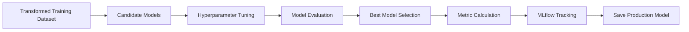
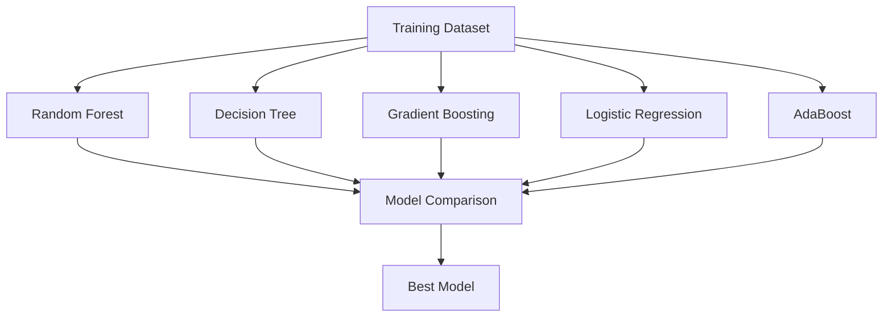
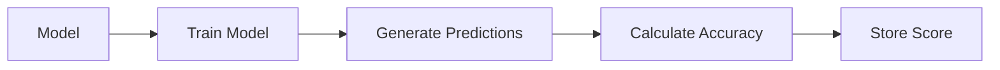
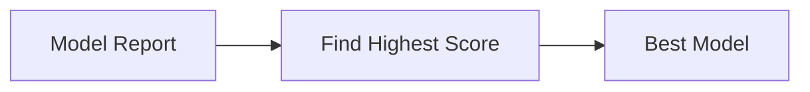
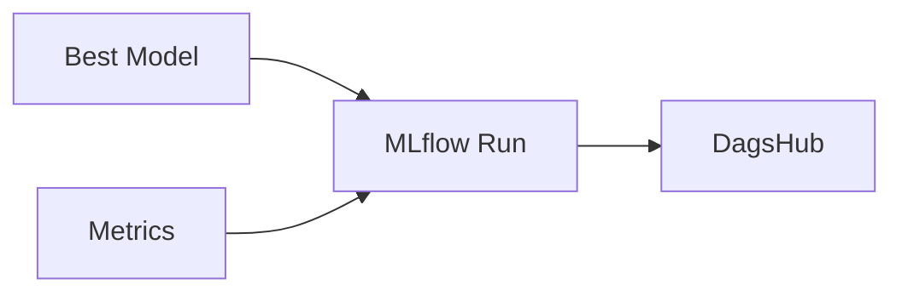

# 15. Model Selection Strategy

## Overview

One of the most important stages in a machine learning pipeline is selecting the best-performing model.

Instead of training a single algorithm and deploying it directly, the Network Security MLOps project follows a systematic model selection strategy:

1. Train multiple candidate models
2. Perform hyperparameter tuning
3. Evaluate performance on unseen data
4. Compare model scores
5. Select the best-performing model
6. Track experiments using MLflow
7. Package the model for production deployment

This approach reduces the risk of choosing a suboptimal model and improves overall prediction quality.

---

# Architecture



---

# Source Code Location

Main implementation:

```text
src/network_security_mlops/components/model_trainer.py
```

Evaluation utility:

```text
src/network_security_mlops/utils/io_utils.py
```

Metric calculation:

```text
src/network_security_mlops/utils/ml_utils/metric/classification_metric.py
```

Production wrapper:

```text
src/network_security_mlops/utils/ml_utils/model/estimator.py
```

---

# Input Artifacts

The Model Trainer receives a DataTransformationArtifact.

```python
DataTransformationArtifact(
    transformed_train_file_path,
    transformed_test_file_path,
    transformed_object_file_path
)
```

Generated by:

```text
03_data_transformation.md
```

---

# Loading Transformed Data

The trainer loads:

```text
train.npy
test.npy
```

Using:

```python
load_numpy_array_data()
```

Example:

```python
train_arr = load_numpy_array_data(
    transformed_train_file_path
)

test_arr = load_numpy_array_data(
    transformed_test_file_path
)
```

---

# Feature and Target Separation

The transformed arrays contain:

```text
[ Features | Target ]
```

The final column is treated as the target variable.

```python
X_train = train_arr[:, :-1]

y_train = train_arr[:, -1]

X_test = test_arr[:, :-1]

y_test = test_arr[:, -1]
```

---

# Candidate Models

The pipeline evaluates multiple machine learning algorithms.

```python
models = {

    "Random Forest":
        RandomForestClassifier(),

    "Decision Tree":
        DecisionTreeClassifier(),

    "Gradient Boosting":
        GradientBoostingClassifier(),

    "Logistic Regression":
        LogisticRegression(),

    "AdaBoost":
        AdaBoostClassifier()
}
```

---

# Model Comparison Architecture



---

# Hyperparameter Tuning

The project uses:

```python
GridSearchCV
```

Location:

```text
utils/io_utils.py
```

---

# Random Forest Search Space

```python
{
    "n_estimators":
        [8,16,32,128,256]
}
```

---

# Decision Tree Search Space

```python
{
    "criterion":
    [
        "gini",
        "entropy",
        "log_loss"
    ]
}
```

---

# Gradient Boosting Search Space

```python
{
    "learning_rate":
        [0.1,0.01,0.05,0.001],

    "subsample":
        [0.6,0.7,0.75,0.85,0.9],

    "n_estimators":
        [8,16,32,64,128,256]
}
```

---

# AdaBoost Search Space

```python
{
    "learning_rate":
        [0.1,0.01,0.001],

    "n_estimators":
        [8,16,32,64,128,256]
}
```

---

# Logistic Regression

Currently uses default parameters.

```python
{}
```

No Grid Search is performed.

---

# Model Evaluation Process

The helper function:

```python
evaluate_models()
```

Performs:

1. Hyperparameter tuning
2. Model fitting
3. Prediction generation
4. Accuracy calculation
5. Score reporting

---

# Evaluation Workflow



---

# Accuracy Calculation

For every model:

```python
train_accuracy =
    accuracy_score(
        y_train,
        y_train_pred
    )

test_accuracy =
    accuracy_score(
        y_test,
        y_test_pred
    )
```

The test accuracy becomes the comparison metric.

---

# Model Selection Logic

After evaluating all models:

```python
best_model_score =
    max(model_report.values())
```

Then:

```python
best_model_name =
    model_with_highest_score
```

Example:

```text
Random Forest : 0.97

Decision Tree : 0.95

Gradient Boosting : 0.98

Logistic Regression : 0.93

AdaBoost : 0.96
```

Selected model:

```text
Gradient Boosting
```

---

# Best Model Architecture



---

# Classification Metrics

Once the best model is selected:

```python
get_classification_score()
```

is executed.

---

# Metrics Generated

## F1 Score

Measures:

```text
Precision vs Recall Balance
```

---

## Precision

Measures:

```text
False Positive Control
```

---

## Recall

Measures:

```text
Threat Detection Capability
```

---

# Classification Metric Artifact

```python
ClassificationMetricArtifact(

    f1_score,

    precision_score,

    recall_score
)
```

Example:

```python
ClassificationMetricArtifact(
    f1_score=0.98,
    precision_score=0.99,
    recall_score=0.97
)
```

---

# MLflow Tracking

After model selection:

```python
track_mlflow()
```

logs:

* F1 Score
* Precision Score
* Recall Score
* Model Artifact

---

# Experiment Tracking Flow



---

# Production Model Packaging

The selected model is combined with the preprocessing pipeline.

```python
NetworkModel(
    preprocessor,
    best_model
)
```

Purpose:

```text
Single object capable of:

1. Preprocessing
2. Prediction
```

---

# Saved Model Artifacts

Training Artifact:

```text
Artifacts/

└── model_trainer/

    └── trained_model/

        └── model.joblib
```

---

Production Artifact:

```text
final_model/

└── model.joblib
```

---

# Final ModelTrainerArtifact

```python
ModelTrainerArtifact(

    trained_model_file_path,

    train_metric_artifact,

    test_metric_artifact
)
```

This artifact becomes the final output of the training pipeline.

---

# Why Multiple Models?

Advantages:

* Reduces bias toward one algorithm
* Finds the best-performing estimator
* Improves generalization
* Enables reproducible experiments
* Supports future model benchmarking

---

# Key Takeaways

* Multiple ML algorithms are trained and compared.
* GridSearchCV performs hyperparameter tuning.
* Accuracy is used for model comparison.
* F1, Precision, and Recall are computed for the best model.
* MLflow tracks metrics and model artifacts.
* The selected model is packaged with the preprocessor.
* The final model is saved for production inference.
* The strategy follows industry-standard model selection practices used in production MLOps systems.
